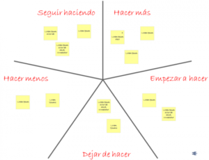

# Inspección y adaptación del proceso

## Retrospectivas

Las retrospectivas del SCRUM concluyen el sprint. Conlleva realizar una reunión y se plantea la oportunidad de que el equipo se inspeccione a sí mismo, pudiendo crear un plan para su mejora.

En el equipo de trabajo para el mini proyecto se establecerá los días viernes para realizar la retrospectiva SCRUM, previo al inicio del siguiente sprint y cerrando el sprint anterior y evaluando cómo se desarrolló el trabajo del sprint.

Se plantean las siguientes preguntas a ser respuestas por el equipo:

- ¿Cómo fue el sprint?
- ¿Qué problemas tuvimos?
- ¿Qué hicimos correctamente?
- ¿Qué queremos mejorar?
- ¿Qué vamos a hacer para conseguirlo?

Con las respuestas obtenidas se realizará un tablero de la especie “estrella de mar”:

Donde se irán colocando las actividades propuestas por el equipo en la casilla que corresponda.

Finalmente se evaluará lo establecido y se planificará el siguiente sprint.

A tener en cuenta para el líder de la retrospectiva no caer en los siguientes problemas:

- Que hable siempre el mismo integrante.
- Se tocan siempre los mismos temas.
- Caer en un sentimiento de pérdida de tiempo.
- Realizar reuniones incómodas.

Para evitar los anteriores problemas se debe:

- Preparar el escenario, romper el hielo de alguna forma y buscar una dinámica para que todos participen.
- Recolectar datos correctamente, una vez que se rompe el hielo se debe registrar todo lo conversado de forma ágil.
- Luego se plantea que se desea mejorar para la próxima reunión, se sigue recolectando información de lo conversado.
- Se extraen los temas más importantes y se realiza el diagrama “estrella de mar”.
- Finalmente se cierra la retrospectiva, el objetivo es que el equipo salga animado y motivado para iniciar el siguiente sprint.