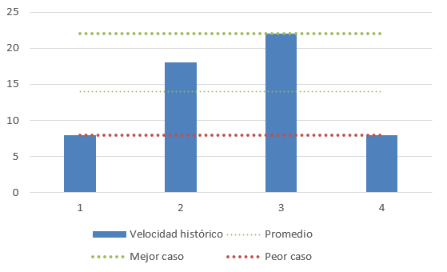

# Ingeniería de Software Ágil 1

# Obligatorio

**_Versión 1.0_**

**N6A, Docente: Juan Pablo Russo**

**Integrantes: Cristian Palma, Federico Alonso, Juan Otegui, Christian Patri.**

19 de noviembre de 2021

**URL del repositorio: https://github.com/juanmaotegui/ObligatorioISA**

# ÍNDICE

### 1. [PREFACIO](#I1)

### 2. [GLOSARIO](#I2)

### 3. [DEFINICIÓN DEL MARCO DE TRABAJO](#I3)

### 4. [PLANIFICACIÓN DE LAS ITERACIONES](#I4)

-   ### 4.1. [Objetivos del Sprint](#I41)
-   ### 4.2. [Estimaciones](#I42)
-   ### 4.3. [Velocidad del equipo y Capacidad del sprint](#I43)

### 5. [SEGUIMIENTO DE LAS ITERACIONES](#I5)

-   ### 5.1. [Daily scrum](#I51)
-   ### 5.2. [Burndown](#I52)

### 6. [INSPECCIÓN Y ADAPTACIÓN DEL PROCESO](#I6)

-   ### 6.1. [Retrospectivas](#I61)

### 7. [REPOSITORIO DEL PROYECTO](#I7)

### 8. [IDENTIFICACIÓN DEL PROBLEMA A RESOLVER](#I8)

### 9. [DEFINICIÓN DEL PROBLEMA](#I9)

### 10. [PROTOTIPOS CON POSIBLES SOLUCIONES](#I10)

### 11. [INSPECCIÓN Y ADAPTACIÓN DEL PRODUCTO](#I11)

-   ### 11.1. [Sprint reviews](#I111)
-   ### 11.2. [Verificación](#I112)
-   ### 11.3. [Validación con usuarios](#I113)

### 12. [REFLEXIÓN FINAL](#I12)

# 1. PREFACIO 

El presente repositorio cuenta con la el trabajo de nuestro equipo donde se adaptó y aplicó los roles establecidos por el marco de gestión SCRUM en cuanto a ceremonias y artefactos principales de acuerdo al contexto y características del presente proyecto.

El objetivo fue descubrir, idear y prototipar un MVP (Minimun Viable Product) para conseguir toda la información actualizada acerca del COVID-19 en Uruguay.

Durante el proyecto se fue descubriendo un producto teniendo en cuenta las principales características recogidas del estudio de otras aplicaciones del mercado y también se agregaron otras funcionalidades no existentes con el objetivo de agregar valor.

Se realizaron 4 iteraciones de 2 semanas cada una desde el 24/09/2021 hasta el 19/11/2021, siguiendo los objetivos establecidos por la rubrica los cuales se desarrollaran a lo largo de este documento.

# 2. GLOSARIO 

Se especifica la terminología utilizada a lo largo del documento:

-   _Software:_ Conjunto de programas que permiten a la computadora realizar determinadas tareas
-   _Usuario_: Persona que utiliza el sistema.
-   _Requerimiento:_ Condición o capacidad de un sistema requerida por el usuario para resolver un problema o alcanzar un objetivo.
-   _SCRUM:_ Marco de trabajo para desarrollo ágil de software, es un proceso en el que se aplican de manera regular un conjunto de buenas prácticas para trabajar colaborativamente, en equipo y obtener el mejor resultado posible de proyectos.
-   _Product Owner:_ Persona responsable de asegurar que el equipo aporte valor al negocio. Representa las partes interesadas internas y externas, por lo que debe comprender y apoyar las necesidades de todos los usuarios en el negocio.
-   _Scrum Master:_ Entrenador y facilitador de equipos Scrum. Ayuda al equipo a mantenerse enfocado en los objetivos del proyecto y elimina los impedimentos que van apareciendo durante el camino.
-   _Definition of Ready:_ Pre-condiciones, las dependencias externas, la información, todo aquello que debe resolverse antes de ponerse a desarrollar una Historia de Usuario.
-   _Definition of Done:_ Conjunto de reglas que determinan cuándo un elemento está terminado. Se puede aplicar a nivel de ítem, de categoría, o release o de Sprint.
-   _Sprint:_ Período de tiempo determinado en el que se realiza todo el trabajo necesario para alcanzar las metas propuestas.
-   _Product Backlog:_ Lista de trabajo ordenado por prioridades para el equipo de desarrollo que se obtiene de la hoja de ruta y sus requisitos. Se trata de una lista dinámica, que irá evolucionando a medida que lo hace el producto y el entorno del proyecto.
-   _Sprint Backlog:_ Elementos del Product Backlog elegidos para trabajar en el Sprint.
-   _Sprint Review:_ Reunión que se celebra con el propósito de evaluar los resultados que obtuvo el equipo Scrum luego de un sprint.
-   _Sprint Retrospective:_ Reunión que tiene lugar al final de cada sprint en la cual reflexionamos sobre la manera en la que trabajamos. Se realiza después del sprint review y antes de la reunión de planificación del siguiente sprint.
-   _Burndown chart:_ Representación gráfica del trabajo por hacer en un proyecto o sprint en el tiempo. Usualmente el trabajo remanente (o backlog) se muestra en el eje vertical y el tiempo en el eje horizontal.
-   _Stakeholders / Interesados:_ Cualquier persona (empleado, socio, cliente, etc.) o empresa que de alguna forma afecta o puede ser afectada por las acciones de un proyecto.
-   _Historia de usuario:_ Unidad de trabajo en un marco ágil consiste en la explicación general de una función de software escrita desde la perspectiva del usuario final o cliente.
-   _Pull request:_ Acción de validar el código antes de que se realice el merge de una rama a otra.

# 3. DEFINICIÓN DEL MARCO DE TRABAJO 

## Roles del equipo

En este mini proyecto tendremos tres roles: Product Owner, Scrum Master y Developer, los cuales asignaremos a cada uno de los integrantes del equipo.

| Integrante         | Rol           |
| ------------------ | ------------- |
| Christian Patri    | Scrum Master  |
| Cristian Palma     | Product Owner |
| Federico Alonso    | Developer     |
| Juan Manuel Otegui | Developer     |

## Políticas de trabajo

#### Acuerdo para las reuniones del Equipo

-   Hacer 4 daily meetings por sprint distribuidas de la siguiente manera:

> Primer semana del sprint : Miércoles 18:00 y Viernes 18:00\
>  Segunda semana del sprint: Lunes 18:00 y Miércoles 18:00

-   Sprint planning: Primer domingo de la primera semana del sprint.

-   Sprint review y sprint retrospective: último día del sprint (viernes de la segunda semana).

#### Definition of Ready

Una historia de usuario estará lista para poder ser planificada y ejecutada cuando se logre verificar que la misma cumple con los criterios INVEST con el objetivo de asegurar la calidad en la escritura de la historia.

Las características a cumplir son:

-   Independiente
-   Negociable
-   Valiosa
-   Estimable
-   Pequeña
-   Testeable

El proceso para escribir la historia comenzará con una primera idea por parte del product owner en conjunto con el cliente. Luego de que estén escritas todas las historias para abarcar el alcance de este proyecto, en equipo discutiremos una por una para determinar lo siguiente:

-   Estamos de acuerdo en realizar esa historia? (SI/NO)
-   En caso negativo la descartamos
-   En caso afirmativo la discutimos para aclarar mejor la idea.
-   Finalmente verificamos característica por característica (INVEST) si la historia cumple haciendo las correcciones pertinentes.
-   Cuando verificamos lo anterior, entonces la declaramos como pronta para ser planificada y ejecutada.

#### Definition of Done

Se utilizará el proceso de BDD para trabajar con las historias de usuario. Para considerar una historia como terminada se deberá seguir los siguientes procesos (primero verificación y luego validación con el cliente):

-   Se conversa con el cliente de una de las necesidades del negocio, en nuestro caso seleccionamos una detallada en la letra del presente proyecto.
-   En equipo escribimos en lenguaje natural la narrativa y los escenarios de la historia de usuario.
-   Desarrollaremos uno o varios prototipos para presentarle al cliente
-   Verificamos que los prototipos cumplan con las siguientes heurísticas de Nielsen:
    1. Visibilidad del estado del sistema.
    2. Coincidencia entre el sistema y el mundo real.
    3. Dale al usuario el control y la libertad.
    4. Consistencia y estándares.
    5. Prevención de errores.
    6. Reconocer en lugar de recordar.
    7. Flexibilidad y eficiencia de uso.
    8. Estética y diseño minimalista.
    9. Ayuda al usuario a reconocer, diagnosticar y recuperarse de los errores.
    10. Ayuda y documentación.
-   Finalmente validamos armando escenarios para hacer validaciones con usuarios de los prototipos creados y obtenemos el feedback.
-   Si no hay correcciones de parte del usuario declaramos la historia como finalizada.
-   En el caso que haya que hacer correcciones se tendrán que realizar en otro sprint previa planificación y luego repetir este ciclo.
-   Al finalizar un sprint luego de hacer una reunión de equipo para el pull request subir el trabajo a la rama main.

Para la construcción de prototipos utilizaremos la [herramienta Framer.](https://framer.com/)

#### Lista a corroborar

-   Los criterios de aceptación se cumplieron
-   Se verifica el grado de cumplimiento de los prototipos con las 10 heurísticas de nielsen
-   El equipo concuerda (desarrolladores y product owner)
-   Se corrigieron las observaciones que surgieron durante la validación del usuario probando los escenarios.

Si cumple con lo anterior, al final del sprint el equipo subirá los cambios a producción, en nuestro caso al final de la iteración reflejamos los cambios en la rama MAIN.

#### Tamaño del WIP (Work in Progress)

-   El tamaño acordado por el equipo es de 1 tarea por cada integrante.
-   Las tareas estarán estimadas para realizarla en 2 días.

#### Revisiones con pull request:

-   El equipo acordó hacer los pull request al finalizar el sprint luego de las reuniones de sprint review y sprint retrospectiva.
-   Se realizará una reunión específica para ejecutar esta tarea luego de debatir y hacer intercambio de ideas.
-   La estrategia es que durante un sprint se abre una rama con el nombre del sprint y al finalizar el mismo se efectuará un merge main.

#### Validaciones de los prototipos:

-   El equipo acordó hacer validaciones de los prototipos creando escenarios.
-   Estas validaciones se podrán realizar durante un sprint para obtener feedback de forma temprana.

# 4. PLANIFICACIÓN DE LAS ITERACIONES 

## 4.1. Objetivos del Sprint

Para determinar los objetivos del sprint nos basamos en la rúbrica establecida por el obligatorio de la siguiente manera:

-   En el primer sprint el objetivo fue identificar el problema a resolver y definir una solución lo cual dio como resultado que se debían construir 18 prototipos definidos en el [Product Backlog](https://github.com/juanmaotegui/ObligatorioISA/blob/main/assets/productBacklog.md).

-   En el segundo y tercer sprint se puso el foco en completar en cada sprint 9 prototipos y de esta forma completar los 18 prototipos que surgieron de la definición de la solución. Además se agregaron tareas que fueron surgiendo de las recomendaciones del docente mediante [Issues](https://github.com/juanmaotegui/ObligatorioISA/issues).

#### Planificación del sprint 2 y 3:

> -   [Sprint planning del Sprint 2](https://github.com/juanmaotegui/ObligatorioISA/blob/main/Sprint2/Evidencia_meetings/1-Sprint_planning_SP2_11-10-21.md).
> -   [Sprint planning del Sprint 3](https://github.com/juanmaotegui/ObligatorioISA/blob/main/Sprint3/meetings/1-Sprint_planning_SP3_24-10-21.md).

-   El objetivo del cuarto sprint fue la confección del informe académico el cual resume los resultados y reflexiona sobre las lecciones aprendidas sobre las prácticas de ingeniería de software ágil.

Gracias a planificar cada sprint pudimos determinar los siguiente:

-   Sprint backlog
-   Lista de tareas de cada historia de usuario
-   Estimación de cada tarea
-   Objetivo del sprint

Como beneficio de esta actividad tenemos la mala experiencia del primer sprint la cual no se realizó esta ceremonia y como resultado se tuvo que trabajar en la segunda iteración para completar los objetivos de la primera iteración.

## 4.2. Estimaciones

El equipo realizó la estimación de las historias de usuario en dos instancias, la primera fue para la confección del product backlog con el objetivo de tener esa información para realizar la priorización del mismo.

La segunda instancia de estimación se realizó para las historias seleccionadas a trabajar durante una iteración. Esto hizo que mejore dado que se tenía la experiencia del sprint anterior.

Para estimar las historias, se utilizó la técnica de "Planning Poker", que se basa en el consenso del equipo y así estimar el esfuerzo o tamaño relativo de cada historia en story points utilizando [planitpoker.com](https://www.planitpoker.com).

## 4.3. Velocidad del equipo y capacidad del sprint

El siguiente reporte muestra la cantidad de historias de usuarios:

 Podemos ver en el mismo, que en las primeras dos iteraciones se completaron de forma tardía historias de usuario y que al final del proyecto el equipo mejoró significativamente.

La segunda y tercera iteración se resolvieron 9 historias de usuario por sprint, se corresponden directamente a los 18 prototipos desarrollados.

#### Cálculo de la velocidad del equipo:

 La cantidad de puntos de historia correspondientes a la iteración 1 y 4 no representa con exactitud la capacidad del equipo dado las particularidades de las mismas.

#### Gráfica:

# 5. SEGUIMIENTO DE LAS ITERACIONES 

## 5.1. Daily scrum

Para el seguimiento de las iteraciones, como fue mencionado en el <a name="I3">marco de trabajo</a> el equipo mantuvo reuniones donde cada miembro hablaba principalmente de los siguientes puntos:

-   ¿Qué se hizo desde la última reunión?
-   ¿Qué se hará hasta la siguiente reunión?
-   ¿He tenido algún problema o inconveniente?

Todo esto con el objetivo de inspeccionar el progreso hacia el objetivo del sprint y adaptar el sprint backlog en caso que sea necesario.

Durante las primeras 2 iteraciones hubieron dificultades para ejecutar las reuniones dado que las mismas no tenían días y horas previamente establecidas.

A partir de la tercera iteración fue solucionado agregando al marco de trabajo los días respectivos lo cual produjo una mejora significativa en la organización del equipo.

#### Evidencia de las Daily meeting durante el proyecto:

> -   [Daily meeting 13/10/2021](https://github.com/juanmaotegui/ObligatorioISA/blob/main/Sprint2/Evidencia_meetings/2-Daily_meeting_13-10-21.md).
> -   [Daily meeting 15/10/2021](https://github.com/juanmaotegui/ObligatorioISA/blob/main/Sprint2/Evidencia_meetings/3-Daily_meeting_15-10-21.md).
> -   [Daily meeting 18/10/2021](https://github.com/juanmaotegui/ObligatorioISA/blob/main/Sprint2/Evidencia_meetings/4-Daily_meeting_18-10-21.md).
> -   [Daily meeting 20/10/2021](https://github.com/juanmaotegui/ObligatorioISA/blob/main/Sprint2/Evidencia_meetings/5-Daily_meeting_20-10-21.md).
> -   [Daily meeting 27/10/2021](https://github.com/juanmaotegui/ObligatorioISA/blob/main/Sprint3/meetings/2-Daily_meeting_27-10-21.md).
> -   [Daily meeting 29/10/2021](https://github.com/juanmaotegui/ObligatorioISA/blob/main/Sprint3/meetings/3-Daily_meeting_29-10-21.md).
> -   [Daily meeting 01/11/2021](https://github.com/juanmaotegui/ObligatorioISA/blob/main/Sprint3/meetings/4-Daily_meeting_01-11-21.md).
> -   [Daily meeting 03/11/2021](https://github.com/juanmaotegui/ObligatorioISA/blob/main/Sprint3/meetings/5-Daily_meeting_03-11-21.md).

## 5.2. Burndown Chart

Para mejorar el seguimiento de las iteraciones, durante las daily meetings se iba analizando la evolución de la Burndown Chart del sprint. Esto nos daba la idea si el equipo iba a poder completar el trabajo en el tiempo estimado. 

Los beneficios de esta herramienta fueron:

-   Determinar cuánto trabajo faltaba por hacer en cada iteración
-   Considerar si había que hacer alguna re-estimación durante el sprint
-   Ver si hay trabajo extra al planificado

La realidad fue que le pudimos sacar provecho a partir de la tercera iteración, dado que antes no íbamos reflejando a diario los estados de las tareas como se puede ver en las siguientes imágenes:

#### Burndown Sprint 2:

 

#### Burndown Sprint 3:

 

Esto nos dejó como lección aprendida visualizar la importancia de la actualización en tiempo real del estado de las tareas y cómo contribuye al equipo en mejorar el seguimiento y la organización de la iteración.

#### Burndown Final:

# 6. INSPECCIÓN Y ADAPTACIÓN DEL PROCESO 

## 6.1. Retrospectivas 

Con el objetivo de aumentar la calidad y efectividad, el equipo al finalizar cada iteración realizó la ceremonia de "Sprint retrospective meeting", la que brindó una oportunidad para podernos inspeccionar como equipo y crear un plan de mejora que se iba a poner en marcha ya para las siguientes iteraciones recolectando aprendizajes.

Cada retrospectiva produjo que fuéramos adaptando el marco de trabajo y nos ayudó a mejorar como equipo, lo cual pudimos notar a partir de la tercera iteración.

Siguiendo las sugerencias del [issue #5](https://github.com/juanmaotegui/ObligatorioISA/issues/5), el equipo experimentó con diferentes dinámicas de retrospectiva para analizar las mejoras del proceso desde distintas perspectivas y preguntas, tales como:

-   [Retromat](https://retromat.org/es/)
-   [Fun Retrospectives](https://www.funretrospectives.com/)

#### Evidencia de las Retrospectivas durante el proyecto:

> -   [Retrospectiva 08/10/2021](https://github.com/juanmaotegui/ObligatorioISA/blob/main/Sprint1/SprintRetro.md).
> -   [Retrospectiva 22/10/2021](https://github.com/juanmaotegui/ObligatorioISA/blob/main/Sprint2/Evidencia_meetings/7-Sprint_Retrospective_22-10-21.md).
> -   [Retrospectiva 05/11/2021](https://github.com/juanmaotegui/ObligatorioISA/blob/main/Sprint3/meetings/7-Sprint_Retrospective_05-11-21.md).

# 7. REPOSITORIO DEL PROYECTO 

Para la ejecución del proyecto se utilizó el presente repositorio de GitHub y siguiendo la sugerencia del [issue #8](https://github.com/juanmaotegui/ObligatorioISA/issues/8) se agregó al Definition of Done la dinámica de los pull request realizando la siguiente [estrategia](https://github.com/juanmaotegui/ObligatorioISA/network):

#### Revisiones con pull request:

-   El equipo acordó hacer los pull request al finalizar el sprint luego de las reuniones de sprint review y sprint retrospectiva.
-   Se realizará una reunión específica para ejecutar esta tarea luego de debatir y hacer intercambio de ideas.
-   La estrategia es que durante un sprint se abre una rama con el nombre del sprint y al finalizar el mismo se efectuará un merge main.

# 8. IDENTIFICACIÓN DEL PROBLEMA A RESOLVER 

La identificación del problema se llevó a cabo en la iteración 1, teniendo en cuenta la letra del mini proyecto y el estudio de aplicaciones similares existentes en el mercado. Al finalizar esta etapa pudimos tener un entendimiento del problema a resolver y las oportunidades de mejora de nuestro producto sobre los existentes. 

Se realizaron las siguientes actividades:

-   Identificación de Interesados
-   Funcionalidades por interesado
-   Estudio de competidores

Como resultado final, logramos documentar un insumo valioso para efectuar los siguientes pasos en el proyecto, el cual se deja en el siguiente link: [Identificación del problema a resolver](https://github.com/juanmaotegui/ObligatorioISA/blob/main/Sprint1/Identificaci%C3%B3n-del-problema.md).

# 9. DEFINICIÓN DEL PROBLEMA 

Tomando en cuenta el documento generado en el punto anterior, el equipo creó un product backlog priorizado con su jerarquía de épicas e historias de usuario con sus criterios de aceptación asociado.
El objetivo del mini-proyecto fue la elaboración de prototipos para representar las funcionalidades de manera de poder interactuar con el cliente y así tener de forma frecuente una retroalimentación la cual se iba teniendo en cuenta para el refinamiento de las historias de usuario.

En esta etapa se realizaron las siguientes actividades y artefactos:

-   Story map
-   Product backlog
-   Épicas
-   Historias de usuario
-   Criterios de aceptación

**Story Map**  

Con el objetivo de organizar mejor nuestro product backlog, construimos  el presente storyMap de la siguiente forma:

* En vertical los 4 sprint
* En horizontal las épicas

Luego en las intersecciones, fuimos colocando cada historia de usuario.

El equipo puede visualizar como se desgranan las épicas por cada sprint, y ver la prioridad entre las historias de usuario.

La técnica de User Story Mapping, permite de una manera visual y colaborativa definir el mapa de funcionalidades de un producto.

Mediante las historia de usuario logramos mostrar lo que es importante para el cliente, entonces para definir la solución, elaboramos un product backlog compuesto por historias de usuario bien escritas respetando que cumplan las siguientes características:

-   Independiente
-   Negociable
-   Valorizable para el Cliente
-   Estimable
-   Pequeña
-   Testeable

La estimación de cada una de estas historias nos ayudó a priorizar las historias dentro del product backlog, y también poder medir la velocidad del equipo después de completar algunas iteraciones.

El requerimiento no funcional que aplicaba para esta instancia "Debe ser fácil de usar por todos los estratos de población." pudimos incluirlo en el definition of done, para asegurarnos que todas las historias cumplan con ello, mediante el proceso de verificación chequeamos el cumplimiento de las 10 heurísticas de nielsen para cada prototipo.

Todo este proceso, nos pareció adecuado dado que pudimos ir mejorando las historias de usuario en las iteraciones ya que nos pareció mucho más flexible que cuando tuvimos que trabajar en los procesos tradicionales definiendo el requerimiento en Fundamentos de Ingeniería de Software.

Se deja en el siguiente link la documentación de la: [Definición del problema a resolver](https://github.com/juanmaotegui/ObligatorioISA/blob/main/Sprint1/Definici%C3%B3n-del-problema.md).

# 10. PROTOTIPOS CON POSIBLES SOLUCIONES 

A lo largo del proyecto fuimos realizando diversos prototipos con la herramienta antes mencionada, y fuimos mejorando los mismos luego de aplicar los procesos de validación y verificación correspondientes.

Como resultado final tenemos el [video de demostración](https://web.microsoftstream.com/video/cddf97fb-098c-481d-85e1-e863544dae44), el cual muestra el flujo principal de los prototipos y explica tanto el problema que se desea resolver con cada uno de ellos, como el valor agregado que brinda la aplicación.

El video de demostración es accesible desde el siguiente enlace: [Video de demostración](https://web.microsoftstream.com/video/cddf97fb-098c-481d-85e1-e863544dae44)

# 11. INSPECCIÓN Y ADAPTACIÓN DEL PRODUCTO 

Para este punto se ejecutaron instancias de validación del producto con usuarios recogiendo feedback que fue documentado.
Otro insumo que utilizamos previo a las instancias de validación, fueron instancias de verificación de todos los prototipos utilizando las siguientes heurísticas de Nielsen:

-   Visibilidad del estado del sistema
-   Coincidencia entre el sistema y el mundo real
-   Dale al usuario el control y la libertad
-   Consistencia y estándares
-   Prevención de errores
-   Reconocer en lugar de recordar
-   Flexibilidad y eficiencia de uso
-   Estética y diseño minimalista
-   Ayuda al usuario a reconocer, diagnosticar y recuperarse de los errores
-   Ayuda y documentación

Si bien se ejecutó y documentó la verificación de los 18 prototipos, el feedback recogido no fue corregido durante el mini-proyecto, salvo las correcciones marcadas en [issue #12](https://github.com/juanmaotegui/ObligatorioISA/issues/12).

Así mismo, para la elaboración de validación con usuarios, se eligieron los 4 prototipos más relevantes:

-   Actualizar condición de salud personal
-   Enviar formulario de contacto con un caso positivo a mi centro de salud.
-   Agendarme con un laboratorio privado para realizar un test.
-   Descargar certificado de vacunación

Al igual que el proceso de verificación, durante la validación se recogió el feedback, no fue corregido en los prototipos.

Tanto el feedback de la verificación como el de la validación fue incluido en el product backlog en las historias de usuario correspondientes.

Como lección aprendida, vimos que al querer abarcar la elaboración de los 18 prototipos, 9 por iteración, dejamos para futuros sprint la corrección del feedback recogido en la verificación y validación, entonces concluimos que sería mejor haber tomado menos cantidad de prototipos para elaborar (4 por cada iteración, o sea 1 por cada miembro) y sobre ellos hacer las correcciones surgidas de la verificación y validación durante en la misma iteración que se estaban elaborando.

### 11.1. Sprint reviews 

Al finalizar cada iteración, el equipo realizó la ceremonia de "Sprint Review" con la finalidad de revisar si se cumplieron los objetivos del sprint, inspeccionar el incremento y adaptar el Product Backlog si fuera necesario.

Durante esta instancia fueron recogidos y documentados los comentarios del "cliente" sobre nuestros prototipos.

Se realizaron al finalizar el sprint 2 y el sprint 3, dado que durante esas iteraciones fueron confeccionados los prototipos.

##### Evidencia de los Sprint review durante el proyecto:

> -   [Sprint review 22/10/2021](https://github.com/juanmaotegui/ObligatorioISA/blob/main/Sprint2/Evidencia_meetings/6-Sprint_review_22-10-21.md).
> -   [Sprint review 05/11/2021](https://github.com/juanmaotegui/ObligatorioISA/blob/main/Sprint3/meetings/6-Sprint_review_05-11-21.md).

### 11.2. Verificación 

Como ya se mencionó con anterioridad, la verificación se realizó en base al estudio de qué tanto cumplían con las heurísticas de Nielsen los prototipos a estudiar, asignando una escala de valores que representa dicho cumplimiento y una descripción del por qué dicho valor es asignado.

A continuación, se deja la documentación de la verificación de los prototipos.

##### Evidencia de verificación de los prototipos:

> -   [01- Registrarme en el sistema](https://github.com/juanmaotegui/ObligatorioISA/blob/main/Prototipos/verificaciones/01-Registrarme%20en%20el%20sistema.md).
> -   [02- Actualizar datos personales](https://github.com/juanmaotegui/ObligatorioISA/blob/main/Prototipos/verificaciones/02-Actualizar%20datos%20personales.md).
> -   [03- Actualizar condición de salud personal](https://github.com/juanmaotegui/ObligatorioISA/blob/main/Prototipos/verificaciones/03-Actualizar%20condicion%20de%20salud%20personal.md).
> -   [04- Login](https://github.com/juanmaotegui/ObligatorioISA/blob/main/Prototipos/verificaciones/04-Login.md).
> -   [05- Restablecer contraseña](https://github.com/juanmaotegui/ObligatorioISA/blob/main/Prototipos/verificaciones/05-Restablecer%20contrase%C3%B1a.md).
> -   [06- Visualizar información relevante para una fecha seleccionada](https://github.com/juanmaotegui/ObligatorioISA/blob/main/Prototipos/verificaciones/06-Visualizar%20informaci%C3%B3n%20relevante%20para%20una%20fecha%20seleccionada.md).
> -   [07- Visualizar información relevante de la evolución de la pandemia en un período](https://github.com/juanmaotegui/ObligatorioISA/blob/main/Prototipos/verificaciones/07-Visualizar%20informaci%C3%B3n%20relevante%20de%20la%20evoluci%C3%B3n%20de%20la%20pandemia%20en%20un%20per%C3%ADodo.md).
> -   [08- Enviar formulario de mis síntomas a mi centro asistencial](https://github.com/juanmaotegui/ObligatorioISA/blob/main/Prototipos/verificaciones/08-Enviar%20formulario%20de%20mis%20s%C3%ADntomas%20a%20mi%20centro%20asistencial.md).
> -   [09- Enviar formulario de contacto con un caso positivo a mi centro asistencial](https://github.com/juanmaotegui/ObligatorioISA/blob/main/Prototipos/verificaciones/09-Enviar%20formulario%20de%20contacto%20con%20un%20caso%20positivo%20a%20mi%20centro%20asistencial.md).
> -   [10- Agendarme con un laboratorio privado para realizar un test](https://github.com/juanmaotegui/ObligatorioISA/blob/main/Prototipos/verificaciones/10-Agendarme%20con%20un%20laboratorio%20privado%20para%20realizar%20un%20test.md).
> -   [11- Visualizar vacunatorios disponibles](https://github.com/juanmaotegui/ObligatorioISA/blob/main/Prototipos/verificaciones/11-Visualizar-Vacunatorio.md).
> -   [12- Comprobar si estoy habilitado para vacunarme](https://github.com/juanmaotegui/ObligatorioISA/blob/main/Prototipos/verificaciones/12-Comprobar%20si%20estoy%20habilitado%20para%20vacunarme.md).
> -   [13- Visualizar resultados de mis Test COVID-19](https://github.com/juanmaotegui/ObligatorioISA/blob/main/Prototipos/verificaciones/13-Visualizar%20resultados%20de%20mis%20Test%20COVID-19.md).
> -   [14- Visualizar registro de mis dosis recibidas](https://github.com/juanmaotegui/ObligatorioISA/blob/main/Prototipos/verificaciones/14-Visualizar%20registro%20de%20mis%20dosis%20recibidas.md).
> -   [15- Ver las notificaciones que me llegan al perfil de mi usuario](https://github.com/juanmaotegui/ObligatorioISA/blob/main/Prototipos/verificaciones/15-Ver%20las%20notificaciones%20que%20me%20llegan%20al%20perfil%20de%20mi%20usuario.md).
> -   [16- Descargar el certificado de vacunación](https://github.com/juanmaotegui/ObligatorioISA/blob/main/Prototipos/verificaciones/16-%20Descargar%20el%20certificado%20de%20vacunaci%C3%B3n.md).
> -   [17- Habilitar las alertas de exposición](https://github.com/juanmaotegui/ObligatorioISA/blob/main/Prototipos/verificaciones/17-Habilitar%20las%20alertas%20de%20exposici%C3%B3n.md).
> -   [18- Comunicar al sistema que recibí un resultado de test positivo](https://github.com/juanmaotegui/ObligatorioISA/blob/main/Prototipos/verificaciones/18-Comunicar%20al%20sistema%20que%20recib%C3%AD%20un%20resultado%20de%20test%20positivo%20.md).

### 11.3. Validación de los prototipos

En este apartado, describiremos las pautas para las tareas de prueba de usabilidad con el fin de involucrar usuarios, escribiendo escenarios de tareas que sean realistas, fomenten una acción y no revelen cómo se debe usar la interfaz y así recolectar feedback de mejora de nuestros prototipos.

En el siguiente [documento](https://github.com/juanmaotegui/ObligatorioISA/blob/main/Prototipos/validacion/Validaciones_de_Prototipos.md) se deja el detalle de los Escenarios de validación propuestos para cada prototipo.

Como se mencionó anteriormente, se validaron con usuarios los siguientes prototipos que fueron seleccionados por ser los más relevantes en conjunto con los que establecen que el usuario tuviera una interacción valiosa con la aplicación:

-   Actualizar condición de salud personal
-   Enviar formulario de contacto con un caso positivo a mi centro de salud.
-   Agendarme con un laboratorio privado para realizar un test.
-   Descargar certificado de vacunación

Se deja disponible el [video](https://web.microsoftstream.com/video/691cd949-67cb-4b30-a84a-a09f9944e522) de la sesión validación con usuarios y el [documento](https://github.com/juanmaotegui/ObligatorioISA/blob/main/Prototipos/validacion/Validancion_con_usuario.md) que recoge el resultado de la misma.

# 12. REFLEXIÓN FINAL

Durante el desarrollo del obligatorio pudimos llevar a la práctica las distintas actividades de Ingeniería de Software Ágil adaptando el marco de trabajo SCRUM a las particularidades de nuestro proyecto, las cuales nos sirvieron para comprender mejor lo aprendido en clase en forma teórica y como guía a lo largo de la ejecución de las 4 iteraciones del presente proyecto.

Este proceso de trabajo frecuente y constante llevó a extraer nuestras propias reflexiones sobre las herramientas antes mencionadas, siendo éstas las que describiremos a continuación.

## Nuevas herramientas

Aprendimos a utilizar herramientas para la planificación y seguimiento de las iteraciones como el Azure Board bajo el esquema SCRUM, lo cual nos facilitó la coordinación del trabajo en equipo y nos ayudó a obtener información mediante los análisis y reportes que pudimos utilizar para interpretar y así monitorear el avance del proyecto.

## Marco de trabajo

Definiendo el marco de trabajo, pudimos establecer el funcionamiento del equipo y adaptar en este apartado las prácticas recomendadas en SCRUM, el cual pudimos ir refinando durante las iteraciones en base a la experiencia y las lecciones aprendidas que fueron reflejadas en cada sprint retrospective y también en las recomendaciones del docente.

### Iteraciones

Durante las iteraciones, aprendimos la importancia de actualizar en tiempo real el estado de las tareas, para hacer un correcto seguimiento y que el mismo pueda verse reflejado en el burndown chart para poder extraer el avance del equipo durante la iteración en las instancias de daily meeting. Esto fue mejorado al establecer el límite del trabajo en progreso, ya que logramos generar mejor foco en cada tarea y aumentar la colaboración.

### Tareas

Además aprendimos la importancia de dividir las tareas de cada historia de usuario, y trabajar en forma dinámica de forma que cada integrante del equipo se iba asignando tareas del sprint backlog, permitiendo al resto de los integrantes conocer en todo momento el trabajo en proceso, el terminado y el trabajo a realizar lo cual mejoró la coordinación del equipo a partir de la tercera iteración cuando ya habíamos entendido mejor la dinámica.

### Sprint retrospective

Al trabajar de forma iterativa, pudimos adaptarnos a los cambios de los requerimientos dado que fuimos profundizando el conocimiento del producto a lo largo de las iteraciones, y también ir adaptando el trabajo en equipo durante las instancias de reflexión al final de cada iteración donde nos cuestionamos la forma de trabajo y la forma de poder mejorarlo respondiendo básicamente alguna de las siguientes preguntas:

-   ¿Qué hicimos bien?
-   ¿Qué tenemos que aprender?
-   ¿Qué cosas podrían salir mejor?
-   ¿Qué salió mal o no nos gustó?

Además esta forma de trabajo nos ayudó a descubrir el dominio del problema mediante la prototipación y así ir aprendiendo más sobre las necesidades para movernos mejor en el espacio de complejidad del proyecto, el cual consideramos "complejo" ya que el equipo tuvo que ir descubriendo el problema a resolver e ir validando durante el obligatorio.

## Conclusión

Finalmente pudimos apreciar que durante el proyecto notamos que los artefactos obtenidos en la primer iteración fueron evolucionando y siendo refinados a lo largo del resto de las iteraciones, lo cual nos da como lección aprendida que a diferencia de los procesos de ingeniería tradicional, en los procesos ágiles se acepta que los requisitos cambien y se trabaja de cerca con los clientes durante todo el proyecto.

Al haber sido un proceso de trabajo constante e ir aprendiendo las distintas instancias y herramientas a largo del mismo, tuvimos el tiempo en cada iteración para ir incorporando cada concepto nuevo visto en clase, lo que conlleva a notar cambios en la calidad del producto entregado iteración a iteración.

Además podemos notar otros beneficios como por ejemplo la eficiencia lograda por el equipo producto de las conversaciones durante las reuniones y el crecimiento gracias a las reflexiones al final de cada sprint que permitieron ajustar y perfeccionar nuestra efectividad en las últimas iteraciones.

