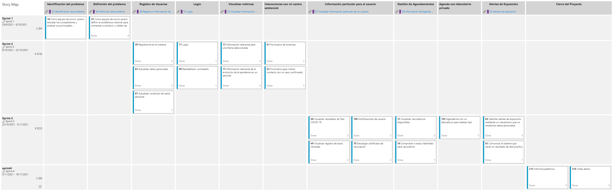

# Definición del problema 

## Story map

## Product backlog

### 01 Registrarse en el sistema
#### Puntos de historia: 2
#### Descripción

> * **Como**: usuario
> * **Quiero**: poder registrarme en el sistema
> * **Para**: acceder a las funcionalidades disponibles para los usuarios registrados

#### Criterios de aceptación 

*Escenario: Registro exitoso de un usuario nuevo*

> * **Dado**: un usuario sin registrarse en el sistema que selecciona la opción "Registrarse"
> * **Cuando**: ingresa: \
         -> CI válida\
         -> Celular válido 
> * **Entonces**: el usuario queda registrado en el sistema

*Escenario: Registro sin éxito de un usuario CI no válida*

> * **Dado**: un usuario sin registrarse en el sistema que selecciona la opción "Registrarse"
> * **Cuando**: ingresa: \ 
        -> CI  no válida\
        -> celular válido (numero ANTEL, CLARO O MOVISTAR de Uruguay)
> * **Entonces**: el sistema lanza un mensaje de error informando que la ci es incorrecta

*Escenario: Registro sin éxito de un usuario celular no válido*

> * **Dado**: un usuario sin registrarse en el sistema que selecciona la opción "Registrarse"
> * **Cuando**: ingresa\ 
    -> CI   válida\
    -> celular NO válido
> * **Entonces**: el sistema lanza un mensaje de error informando que el celular no es válido

*Escenario: Registro sin éxito de un usuario CI ya registrada*

>  * **Dado**: un usuario sin registrarse en el sistema que selecciona la opción "Registrarse"
> * **Cuando**: ingresa\ 
    -> CI   ya registrada en el sistema\
    -> celular NO válido
> * **Entonces**: el sistema lanza un mensaje de error informando que la CI ya se encuentra registrada en el sistema
### 02 Actualizar datos personales
#### Puntos de historia: 2
#### Descripción

> * **Como**: usuario registrado y autenticado
> * **Quiero**: poder cambiar mis datos personales
> * **Para**: tener actualizado dicha información

#### Criterios de aceptación

*Escenario: usuario autenticado actualiza correctamente sus datos*

>  * **Dado**: un usuario correctamente autenticado en el menú de Actualizar datos personales
> * **Cuando**: modifica alguno de los siguientes datos:\
    -> Nombre completo (no vacío)\
    -> Teléfono  (válido)\
    -> Fecha de nacimiento\
    -> Departamento\
    -> Dirección\
    -> Prestador de Salud\
  y oprime el botón "Confirmar"
> * **Entonces**: el sistema actualiza los datos del usuario

*Escenario: usuario autenticado actualiza incorrectamente sus datos*

>  * **Dado**: un usuario correctamente autenticado en el menú de Actualizar datos personales
> * **Cuando**: modifica alguno de los siguientes datos:\
        -> Nombre completo (vacío)\
        -> Teléfono  (no válido)\
        -> Fecha de nacimiento\
        -> Departamento\ 
        -> Dirección\
        -> Prestador de Salud\
        y oprime el botón "Confirmar"
> * **Entonces**: el sistema informa "nombre incorrecto" y  "teléfono incorrecto"  marcando el error en los campos donde fue ingresada la información.
### 03 Actualizar condición de salud personal
#### Puntos de historia: 2
#### Descripción

> * **Como**: usuario autenticado
> * **Quiero**: poder actualizar mi condición de salud
> * **Para**: recibir las notificaciones pertinentes al plan de vacunación que correspondan a mi condición especifica de salud

#### Criterios de aceptación

*Escenario: usuario autenticado actualiza correctamente su condición de salud*

> * **Dado**: un usuario autenticado que se encuentra en el menú "Actualizar condición de salud"
> * **Cuando**: modifica alguna de las siguientes condiciones seleccionando (SI o NO)\
        -> diabetes (SI/NO)\
        -> enfermedad cardiovascular (SI/NO)\ 
        -> inmunodeficiencia congénita o adquirida (SI/NO)\
        -> cáncer (SI/NO)\
        -> VIH (SI/NO)
> * **Entonces**: el sistema actualiza los datos y el usuario visualiza un mensaje "Datos actualizados correctamente"
### 04 Login
#### Puntos de historia: 1
#### Descripción

> * **Como**: un usuario registrado
> * **Quiero**: poder iniciar sesión
> * **Para**: poder utilizar los recursos de la plataforma

#### Criterios de aceptación

*Escenario: Inicio de sesión usuario registrado*

>  * **Dado**: un usuario registrado y  una contraseña correcta
> * **Cuando**: inicia sesión
> * **Entonces**: puede acceder a los recursos que tiene permiso

*Escenario: Inicio de sesión fallido sin bloqueo de usuario*

>  * **Dado**: un usuario registrado y una contraseña incorrecta y sin intentos fallidos para el usuario registrado
> * **Cuando**: inicia sesión
> * **Entonces**: el usuario es notificado de su error y el sistema contabiliza el intento fallido

*Escenario: Inicio de sesión fallido con bloqueo de usuario*

>  * **Dado**: un usuario registrado y una contraseña incorrecta y 2 intentos fallidos para el usuario registrado
> * **Cuando**: inicia sesión
> * **Entonces**: el usuario es notificado de su error y el usuario es bloqueado para acceder al sistema
### 05 Restablecer contraseña
#### Puntos de historia: 1
#### Descripción

> * **Como**: usuario
> * **Quiero**: poder restablecer mi contraseña
> * **Para**: poder ingresar al sistema en el caso que haya olvidado la misma

#### Criterios de aceptación

*Escenario: usuario registrado en el sistema que solicita recuperar la contraseña con éxito*

>  * **Dado**: un usuario registrado no autenticado en el menú de "recuperar la contraseña"
> * **Cuando**: ingresa:\ 
    -> cédula (registrada en el sistema)\
    -> celular (registrado en el sistema)
> * **Entonces**: el sistema envía un sms al usuario con una contraseña nueva.

*Escenario: usuario registrado en el sistema que solicita recuperar la contraseña indicando una CI  o teléfono no válida*

>  * **Dado**: un usuario registrado no autenticado en el menú de "recuperar la contraseña"
> * **Cuando**: ingresa:\ 
    -> cédula (no válida)\
    -> celular  (no válida)
> * **Entonces**: el sistema informa mediante un mensaje de error:  "CI y/o Celular no válido"

*Escenario: usuario solicita recuperar la contraseña indicando datos inexistentes en el sistema.*

>  * **Dado**: un usuario no autenticado en el menú de "recuperar la contraseña"
> * **Cuando**: ingresa:\ 
        -> cédula (inexistente en el sistema)\
        -> celular (inexistentes en el sistema)
> * **Entonces**: el sistema informa mediante un mensaje de error:  "CI y/o Celular no registrados"
### 06 Información relevante para una fecha seleccionada
#### Puntos de historia: 2
#### Descripción

> * **Como**: usuario
> * **Quiero**: poder visualizar la información de la pandemia en Uruguay en una fecha seleccionada
> * **Para**: poder estar informado de la situación sanitaria del país

#### Criterios de aceptación 

*Escenario: usuario selecciona una fecha para ver los datos de la pandemia en Uruguay*

>  * **Dado**: un un usuario autenticado o no autenticado en el menú "Información" pestaña por fecha
> * **Cuando**: el usuario selecciona una fecha
> * **Entonces**: puede visualizar los siguientes datos relevantes de la pandemia:\
    -> Casos nuevos\
    -> Casos totales\
    -> Casos en CTI\
    -> Fallecidos\
    -> Fallecidos totales\
    -> Test realizados\
    -> Porcentaje de test positivos
### 07 Información relevante de la evolución de la pandemia en un período
#### Puntos de historia: 3
#### Descripción

> * **Como**: usuario
> * **Quiero**: poder visualizar la información de la evolución de la pandemia de forma gráfica
> * **Para**: poder comprender de forma rápida la evolución de la pandemia en Uruguay

#### Criterios de aceptación 

*Escenario: usuario visualiza información de la evolución de la pandemia en un periodo seleccionado*

>  * **Dado**: un un usuario autenticado o no autenticado en el menú "Información" pestaña por período
> * **Cuando**: el usuario selecciona una período:\
    -> Últimos 60 días\
    -> Últimos 30 días\
    -> Últimos 14 días\
    -> Todo (desde el 01/03/2020)
> * **Entonces**: puede visualizar los siguientes datos relevantes de la pandemia de forma gráfica:\
    -> evolución de casos nuevos\
    -> evolución de test realizados\
    -> evolución de los casos activos\
    -> evolución de fallecidos\
    -> ocupación CTI
### 08 Formulario de síntomas
#### Puntos de historia: 2
#### Descripción

> * **Como**: usuario registrado en el sistema
> * **Quiero**: tener un diagnóstico informando los síntomas que presento
> * **Para**: saber si tengo la posibilidad de estar infectado con COVID-19

#### Criterios de aceptación 

*Escenario: usuario autenticado completa con éxito formulario "tengo síntomas"*
> * **Dado**: un usuario autenticado que selecciona la función "tengo síntomas"
  Y con el centro de salud en estado "confirmado"
> * **Cuando**: completa la información (SI/NO) de los siguientes síntomas:\
        -> tos\
        -> fiebre mayor a 37.8° C\
        -> dificultar al respirar\ 
        -> resfrío\
        -> dolor de garganta\
        -> pérdida de olfato\ 
        -> pérdida del gusto.
> * **Entonces**: la aplicación le envía una notificación al centro de salud del usuario correspondiente con los datos del formulario
  y se le informa al usuario "los datos fueron enviado con éxito, su centro de salud se pondrá en contacto con Ud"
### 09 Formulario para indicar contacto con un caso confirmado
#### Puntos de historia: 3
#### Descripción

> * **Como**: usuario registrado en el sistema
> * **Quiero**: poder informar a mi prestador de salud que tuve contacto con un caso confirmado de COVID-19
> * **Para**: poder coordinar un test que verifique si me encuentro infectado

#### Criterios de aceptación 

*Escenario: usuario autenticado completa con éxito formulario "contacto con un caso confirmado"*

>  * **Dado**: un usuario autenticado que selecciona la función "Tuve contacto con un caso confirmado"
   Y con el centro de salud en estado "confirmado"
> * **Cuando**: completa la información:\
        -> fecha del contacto\
        -> lugar donde fue el contacto (opcional)\
        -> ci del contacto (opcional)\
        -> nombre del contacto (opcional)\
        -> síntomas (SI/NO)  tos, fiebre mayor a 37.8° C, dificultar al respirar, resfrío, dolor de garganta, -> pérdida de olfato, pérdida del gusto. 
> * **Entonces**: la aplicación le envía una notificación al centro de salud del usuario correspondiente con los datos del formulario
  y se le informa al usuario que debe hacer cuarentena hasta realizar TEST PCR
  y  que su centro de salud se pondrá en contacto
### 10 Agendarme con un laboratorio para realizar test
#### Puntos de historia: 5
#### Descripción

> * **Como**: usuario
> * **Quiero**: poder visualizar los vacunatorios disponibles
> * **Para**: poder decidir una fecha, horario y lugar posible para agendarme a recibir una dosis de la vacuna contra COVID-19
#### Criterios de aceptación
### 11 Visualizar resultados de Test COVID-19
#### Puntos de historia: 1
#### Descripción

> * **Como**: usuario registrado
> * **Quiero**: ver los resultados de Test de COVID-19 realizados
> * **Para**: saber lo antes posible si estoy infectado de COVID-19

#### Criterios de aceptación 

*Escenario: usuario autenticado visualiza con éxito resultados de test COVID-19*

>  * **Dado**: un usuario autenticado
> * **Cuando**: el usuario selecciona la opción "Resultados de test"
> * **Entonces**: el usuario ve la siguiente información:\
        -> Fecha del test\
        -> Tipo de test (PCR / Antígenos)\
        -> Resultado (PENDIENTE / PENDIENTE RESULTADO / NEGATIVO / POSITIVO)
### 12 Visualizar registro dosis recibidas
#### Puntos de historia: 1
#### Descripción

> * **Como**: usuario registrado
> * **Quiero**: visualizar las vacunas de COVID-19 que he recibido
> * **Para**: saber si estoy cumpliendo correctamente el proceso del plan de vacunación

#### Criterios de aceptación 

*Escenario: usuario autenticado visualiza con éxito la información de vacunas recibidas*

>  * **Dado**: un usuario autenticado
> * **Cuando**: el usuario selecciona la opción "Vacunas recibidas"
> * **Entonces**: el usuario ve la siguiente información:\
       -> Fecha de la vacuna\
       -> Laboratorio (PFIZER, CORONAVAC, etc)
### 13 Descargar certificado de vacunación
#### Puntos de historia: 2
#### Descripción

> * **Como**: usuario autenticado
> * **Quiero**: descargar mi certificado de vacunación
> * **Para**: presentarlo Como comprobante en situaciones que así lo requieran

#### Criterios de aceptación 

*Escenario: Usuario registrado y vacunado con alguna dosis*

> * **Dado**: un usuario autenticado y con al menos una dosis
> * **Cuando**: solicita el certificado de vacunación
> * **Entonces**: se descarga el certificado de vacunación

*Escenario: Usuario no registrado*

>  * **Dado**: un usuario no autenticado
> * **Cuando**: solicita el certificado de vacunación
> * **Entonces**: se le notifica que debe autenticarse para solicitar el certificado

*Escenario: Usuario registrado y sin ninguna dosis*

>  * **Dado**: un usuario autenticado
> * **Cuando**: solicita el certificado de vacunación
> * **Entonces**: se le notifica que no tiene ninguna dosis y no se descarga el certificado
### 14 Notificaciones de usuario
#### Puntos de historia: 1
#### Descripción

> * **Como**: usuario autenticado
> * **Quiero**: recibir notificaciones relevantes respecto a mi estado
> * **Para**: tener la información disponible de manera rápida y estar informado

#### Criterios de aceptación 

*Escenario: usuario autenticado visualiza con éxito notificaciones recibidas*

>  * **Dado**: un usuario autenticado
> * **Cuando**: el usuario selecciona la opción "Notificaciones"
> * **Entonces**: el usuario ve la siguiente información:\
        -> Resultado de un test realizado\
        -> Cambios en el plan de vacunación\
        -> Si he estado expuesto a un caso confirmado mediante las alertas de exposición
### 15 Visualizar vacunatorios disponibles
#### Puntos de historia: 3
#### Descripción
> * **Como**: usuario
> * **Quiero**: poder visualizar los vacunatorios disponibles
> * **Para**: poder decidir una fecha, horario y lugar posible para agendarme a recibir una dosis de la vacuna contra COVID-19

#### Criterios de aceptación 

*Escenario: usuario autenticado o no autenticado visualiza con éxito vacunatorios*
>  * **Dado**: un usuario autenticado o no autenticado
> * **Cuando**: el usuario selecciona la opción "visualizar vacunatorios"
> * **Entonces**: se le despliega una lista de vacunatorios ordenados de menor a mayor distancia 
   y una opción "ampliar info" que le permite ver los siguientes datos detallados del vacunatorio seleccionado:\
        -> Horario de atención\
        -> Ubicación\
        -> días y horarios disponibles para agendar vacuna
### 16 Comprobar si estoy habilitado para vacunarme
#### Puntos de historia: 1
#### Descripción

> * **Como**: usuario
> * **Quiero**: comprobar si estoy habilitado por el MSP para recibir una dosis contra COVID-19
> * **Para**: saber si puedo agendarme para recibir las dosis de vacunación
#### Criterios de aceptación

*Escenario: usuario autenticado visualiza con éxito consulta "¿Estoy habilitado para vacunarme?"*

>  * **Dado**: un usuario autenticado que completó el plan de vacunación
> * **Cuando**: el usuario selecciona la opción "¿Estoy habilitado para vacunarme?"
> * **Entonces**:  el sistema le informa al usuario "Ud. ya completó el proceso de vacunación"

*Escenario: usuario autenticado visualiza con éxito consulta "¿Estoy habilitado para vacunarme?"*

>  * **Dado**: un usuario autenticado que no tenga completo el plan de vacunación
> * **Cuando**: el usuario selecciona la opción "¿Estoy habilitado para vacunarme?"
> * **Entonces**: se le informa al usuario "Ud está habilitado para agendarse"

*Escenario: usuario autenticado visualiza sin éxito consulta "¿Estoy habilitado para vacunarme?"*

>  * **Dado**: un usuario autenticado 
> * **Cuando**: el usuario selecciona la opción "¿Estoy habilitado para vacunarme?"
   y el usuario tiene ingresada la fecha de nacimiento incorrecta en sus datos personales
> * **Entonces**: se le informa al usuario "Alguno de los datos proporcionados no es correcto"
### 17 Habilitar alertas de exposición mediante un mecanismo que no revele mis datos personales
#### Puntos de historia: 5
#### Descripción

> * **Como**: usuario registrado en el sistema
> * **Quiero**: habilitar alertas de exposición de forma anónima
> * **Para**: saber si tuve un contacto cercano con un caso un usuario que haya sido diagnosticado positivo a COVID-19

#### Criterios de aceptación 

*Escenario: Usuario autenticado habilita las alertas de exposición con éxito*

>  * **Dado**: un usuario autenticado
> * **Cuando**: selecciona la opción "habilitar alertas de exposición"
   y acepta términos y condiciones 
> * **Entonces**: se le notifica que la alerta de exposición está activada

*Escenario: Usuario autenticado habilita las alertas de exposición sin éxito*

> * **Dado**: un usuario autenticado
> * **Cuando**: selecciona la opción "habilitar alertas de exposición"
    y NO acepta términos y condiciones 
> * **Entonces**: el sistema le notifica: "Para habilitar la Alerta de exposición debe aceptar términos y condiciones"
   y no se habilitan la alerta de exposición
### 18 Comunicar voluntariamente que recibí el resultado de un test positivo
#### Puntos de historia: 1
#### Descripción

> * **Como**: usuario registrado
> * **Quiero**: informar al sistema que fui diagnosticado positivo para COVID-19
> * **Para**: que el sistema informe a los que tienen la alerta de exposición activadas que corren riesgo de estar infectados.

#### Criterios de aceptación 

*Escenario:Usuario autenticado informa con éxito que recibió el resultado de un test positivo*

>  * **Dado**: un usuario autenticado
> * **Cuando**: selecciona la opción "Soy un caso confirmado de con COVID-19 "
> * **Entonces**: el sistema notifica a los usuarios expuestos que son posibles contactos con un caso confirmado COVID-19 
   y se le ofrece la opción de informar al prestador de salud
### RNF 01 La aplicación debe poder escalar a millones de usuarios (minimamente a toda la población uruguaya)

Este requerimiento no va a ser analizado en ninguno de los 4 sprint del mini proyecto.
### RNF 02 Debe ser fácil de usar por todos los estratos de población.

Este requerimiento lo vamos a integrar dentro del definition of done ya que es un requerimiento tranversal a todas las historias de usuario, para ello vamos a verificar el cumplimiento de las 10 heurísticas de nielsen en la verificación de cada prototipo.
### RNF 03 Debe poder mantener la privacidad de datos sensibles de sus usuarios.

Este requerimiento no va a ser analizado en ninguno de los 4 sprint del mini proyecto.
### RNF 04 Debe contar con una interfaz principalmente móvil (iOS y Android).

Los prototipos durante el mini proyecto los estaremos diseñando para iphone 12, ya que diseñarlos en las diferentes interfaces llevaría mucho tiempo y entendemos que no es el objetivo del mini proyecto.

## Priorización de los prototipos principales a construir

 Para priorizar las historias de usuario, el product owner va utilizar los siguientes criterios de priorización:
 
 * Valor que los usuarios asignan a la visión del producto (Business Value)
 * Esfuerzo que llevará desarrollar cada historia (Story points)

Para obtener los Story points se utilizó la técnica de "Estimación poker".

Los Business Value son asignados por el product owner, y refleja cuánto merece la pena que una historia sea desarrollada en términos del valor para el negocio.

Para estimar el Business Value de cada una de las historias de usuario se definió la historia de usuario del backlog con el valor más bajo es (la que considera menos importante de desarrollar):

* #16 Comprobar si estoy habilitado para vacunarme

Posteriormente se eligió una segunda historia, pero en este caso, la que considera de máximo valor para implementar:

* #10 Agendarme con un laboratorio privado para realizar un test

A continuación se definió estas dos historias en cada extremo de una escala y proporcionalmente entre ellas, introduce todas las otras historias puntuadas según el criterio de negocio.

Para priorizar las historias vamos a utilizar la Técnica Business Value&StoryPoints que utiliza el cociente Business Value/StoryPoints. Es decir, lo más sencillo de implementar que devenga en mayor interés para el usuario.

| Historia   |      Business Value      |  Story Points |  Cociente |
|----------|:-------------:|------:|------:|
| # 01 | 6 | 2  | 3|
| # 02 | 6 | 2  | 3|
| # 03 | 4 | 2  | 2|
| # 04 | 4 | 1  | 4|
| # 05 | 3 | 1  | 3|
| # 06 | 9 | 2  | 4,5|
| # 07 | 9 | 3  | 3|
| # 08 | 10 | 2  |5 |
| # 09 | 10 | 3  |3,333333333 |
| # 10 | 12 | 5  |2,4 |
| # 11 | 4 | 1  | 4|
| # 12 | 4 | 1  | 4|
| # 13 | 6 | 2  | 3|
| # 14 | 3 | 1  | 3|
| # 15 | 7 | 3  | 2,333333333|
| # 16 | 1 | 1  | 1|
| # 17 | 3 | 5  | 0,6|
| # 18 | 1 | 5  | 1|
