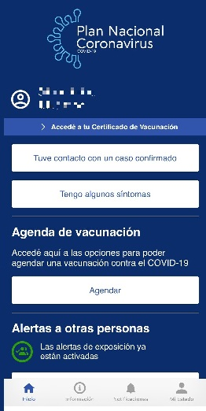
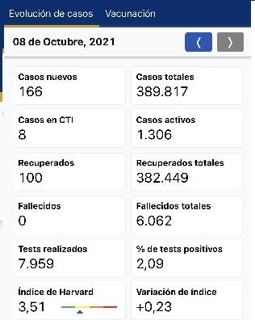
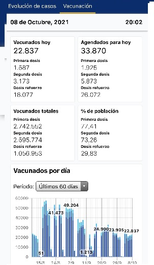
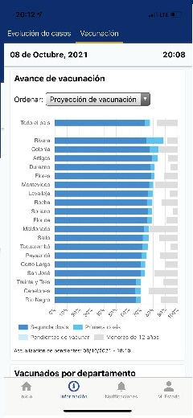
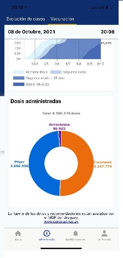
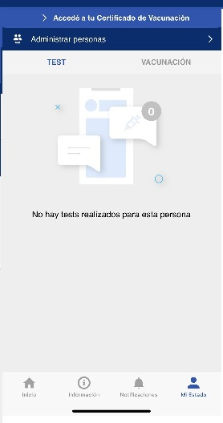

# Identificación del problema a resolver

El resultado del proyecto es poder descubrir, idear y prototipar un MVP (Minimun Viable Product) para conseguir toda la información actualizada acerca del COVID-19 en Uruguay.

El MVP de la aplicación está dirigida principalmente a la población uruguaya como usuarios finales. La aplicación deberá contemplar y priorizar las siguientes características principales:

- Registro de las dosis restantes de la población en los diferentes vacunatorios con sus horarios disponibles.

- Métricas del estado de la enfermedad relevantes para la población como casos activos, test realizados, etc.

- Diagnóstico de posibles síntomas y su probabilidad de indicar contagio.

- Alertas de exposición recientes al COVID-19.

Se solicita a su vez el cumplimiento de los siguientes RNF:

- La aplicación debe poder escalar a millones de usuarios (mínimamente a toda la población uruguaya).

- Debe ser fácil de usar por todos los estratos de población.

- Debe poder mantener la privacidad de datos sensibles de sus usuarios.

- Debe contar con una interfaz principalmente móvil (iOS y Android).

## Actividad de análisis de aplicaciones similares existentes en el mercado

### Ingeniería Reversa Coronavirus uy

#### Introducción

A continuación se extrae requerimientos funcionales usando el método de ingeniería reversa en la aplicación Coronavirus Uy, donde se analiza la forma de resolver el problema que utilizó la competencia.

#### Pantalla principal

En la presente, luego de ingresar aparece la información que resume las funcionalidades, permite en una sola página realizar las principales funciones.

##### Funcionalidades extraidas:

###### Acceder al certificado de vacunación

    - Como usuario puedo acceder a mi certificado de vacunación.

###### Informar contacto con positivo

    - Como usuario puedo informar si tuve contacto con un positivo.

###### Informar si tengo síntomas

    - Como usuario puedo informar si tengo síntomas de la enfermedad.

###### Configurar las alertas de exposición

    - Como usuario puedo verificar si tuve posibilidad de contacto con algún caso positivo.

#### Pantalla información

En la presente, puedo informarme de la situación actual de la enfermedad en el país, casos nuevos, vacunados, tests, etc. Tengo un panorama general de cómo transcurren los hechos día a día.

##### Funcionalidades extraidas:

###### Acceder a la información de la situación nacional

    - Como usuario puedo ver por fecha la siguiente información:

        - Casos nuevos
        - Casos totales
        - Casos en CTI
        - Fallecidos
        - Fallecidos totales
        - Test realizados
        - Porcentaje de test positivos

###### Acceder a la información de forma gráfica:

    - Evolución de casos nuevos
    - Evolución de test realizados
    - Evolución de los casos activos
    - Evolución de fallecidos
    - ocupación CTI
     
     En un período seleccionado:

    - Últimos 60 días
    - Últimos 30 días
    - Últimos 14 días
    - Todo (desde el 01/03/2020)

#### Pantalla notificaciones

En la presente, puedo verificar todo el historial de notificaciones que se recibieron de la aplicación.

##### Funcionalidades extraidas:

###### Historial de notificaciones

Como usuario puedo acceder a un historial de todas las notificaciones que obtuve en el uso de la aplicación.

#### Pantalla Mi Estado

En la presente pantalla obtengo información de mi estado con respecto a la enfermedad y tengo acceso a mis certificados y tests.

##### Funcionalidades extraidas:

###### Certificado de vacunación

Como usuario puedo acceder a mi certificado de vacunación.

###### Resultado de tests

Como usuario puedo acceder al resultado de los test que me he realizado.

## Lista de funcionalidades 

A continuación se hace un listado de posibles funcionalidades teniendo como referencia las funcionalidades requeridas por el proyecto, funcionalidades no desarrolladas por otra aplicación y  funcionalidades existentes que se pueden mejorar de las actualmente ofrecidas por la aplicación de la competencia:

* 01 Registrarme en el sistema
* 02 Actualizar datos personales
* 03 Actualizar condición de salud personal
* 04 Login
* 05 Restablecer contraseña
* 06 Obtener información relevante de la pandemia para una fecha seleccionada
* 07 Obtener información relevante de la pandemia para un período seleccionado
* 08 Informar mis síntomas a mi centro asistencial para recibir un diagnóstico
* 09 Informar a mi centro asistencial que tuve contacto con un caso confirmado de COVID-19
* 10 Agendarme con un laboratorio privado para realizar un test de COVID-19
* 11 Visualizar vacunatorios disponibles
* 12 Comprobar si estoy habilitado para vacunarme
* 13 Visualizar mis resultados de Test COVID-19
* 14 Visualizar registro de dosis recibidas
* 15 Recibir notificaciones en mi perfil de usuario
* 16 Descargar el certificado de vacunación
* 17 Habilitar alertas de exposición mediante un mecanismo que no revele mis datos privados
* 18 Informar al sistema que he sido diagnosticado COVID-19 positivo

## Funcionalidades e Identificación de la lista de Interesados  

Los interesados son las personas, grupos u organizaciones que podrían afectar o ser afectados por una decisión,
actividad o resultado del presente proyecto por ello es importante analizar y documentar la información relativa
a sus intereses, participación, influencia y posible impacto del proyecto con el objetivo de gestionar correctamente
cada interesado.

Se pudieron determinar los siguientes interesados:

    - Población uruguaya.
    - Prestadores de salud.
    - Vacunatorios.
    - Ministerio de Salud Pública.
    - Laboratorios privados (TEST)
    - AGESIC.
    - App store, Google Play.
    - Aplicaciones de terceros (competidores).
    

### Población uruguaya

Son los principales interesados ya que el éxito del proyecto será evaluado en la utilidad que estos le encuentren a nuestra APP.
Para ello es importante ofrecer seguridad en la protección de sus datos y mejorar las funcionalidades de la competencia al mismo tiempo de agregar funcionalidades que la misma no tenga.
Van a utilizar todas las funcionalidades propuestas en la lista de funcionalidades.

### Prestadores de salud

Los prestadores de salud interactuan con los usuarios de la aplicación pero NO por medio de ella. No se espera crear usuarios con "Rol" prestador de salud, por lo tanto el estudio de los mismos no es relevante en esta etapa del proyecto.

### Vacunatorios

Si bien habrá información de sus horarios de atención, disponibilidad de agenda y ubicación para ofrecer a los usuarios de la APP, no se espera que interactuen con la aplicación. En esta fase de prototipado no son relevantes.

### Ministerio de Salud pública

De ellos depende consumir la información necesaria para que nuestros usuarios puedan visualizar la información la mayoría de la información que dispone nuestro sistema:

   - Ver información relevante de la pandemia para una fecha seleccionada
   - Ver información relevante de la pandemia en un período seleccionado
   - Comprobar si está habilitado para vacunarme
   - Visualizar resultados de Test COVID-19 realizados
   - Descargar certificado de vacunación.

Tiene buena relación con la aplicación de la competencia, por lo que puede ser negativo para nuestra aplicación.

### Laboratorios privados (TEST)

Tienen como objetivo realizar los test, por eso se agrega funcionalidad para coordinar TEST particulares a los usuarios que así lo requieran, como por ejemplo para viajar. 

Nuestro objetivo es captar el interés comercial de los mismos mediante la funcionalidad:

- Agendarme con un laboratorio privado para realizar test

y ofrecer una funcionalidad que no existe en la aplicación de la competencia.

### AGESIC

Entendemos que tiene el rol como gobierno electrónico de asegurar que la información de los usuarios de nuestro sistema cumpla estrictamente con la protección de datos personales. Para ello debemos tener clara las normativas que exigen para cuidar la seguridad de nuestras bases de datos.
No es relevante el estudio en esta fase del proyecto ya que no se hará ningún desarrollo.

### App store, Google Play.

Estas plataformas tienen políticas que nuestra aplicación debe cumplir para ser aprobadas a estar disponibles para la descarga. Es importante manejar bien estos requerimientos con el objetivo de que los usuarios finales puedan descargar nuestra APP.
No es relevante el estudio en esta fase del proyecto ya que no se hará ningún desarrollo.

### Aplicaciones de terceros (competidores)

Como hablamos anteriormente, la APP de la competencia ya es conocida por la población uruguaya, incluso hasta el gobierno maneja como APP oficial y se le ha dado publicidad en todos los medios. Hay noticias que la misma será utilizada como pasaporte sanitario oficial, por lo tanto afecta negativamente que los usuarios finales deseen tener dos APP para manejar las mismas funcionalidades.
Luego de hacer el estudio de las funcionalidades que ofrecen, se decidió agregar algunas funciones que no existen y mejorar otras que actualmente se ofrecen.

## Propuesta de valor

Luego del análisis de los interesados, creemos que la oportunidad de mejora es ofrecer una funcionalidad que no existe en la actual aplicación Corona App, agregando la posibilidad a los usuarios de agendarse test con laboratorios privados. De esta manera podríamos contar con el apoyo de estos laboratorios para promover nuestra app.

Además mejoraremos algunas funcionalidades existentes, brindando información adicional a nuestros usuarios para que les llegue una notificación cuando por decisión del MSP hayan cambios en el plan de vacunación, que sean notificados de forma personalizada basándose en su propio estado de salud si corresponde que se tengan que suministrar una nueva dosis.

