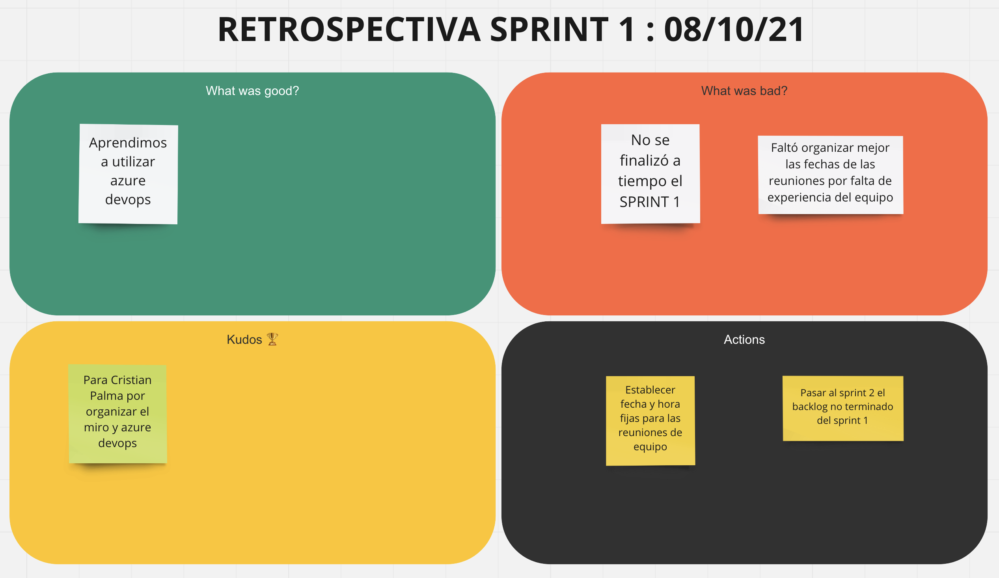

## Sprint Review y Sprint Retro

En este sprint nos dedicamos a la configuración del espacio de trabajo, armar el backlog con las historias, es decir no hubo implementación por lo tanto no correspondía tener una ceremonia de Sprint Review y tener una demo.  
Se realizó la ceremonia del Sprint Retro, en esta armamos un tablero de miro con cuatro secciones, donde agregamos post it en cada una de estas.  

Las secciones son las siguientes:
 - Que fue bien
 - Que fue mal
 - Acciones a realizar
 - Kudos (Reconocimiento de esfuerzo)

De esta reunión obtuvimos conclusiones y mejoras a realizar para los proximos sprints.  

También se le dieron 'Kudos' al integrante Cristian Palma por le trabajo realizado en este sprint.