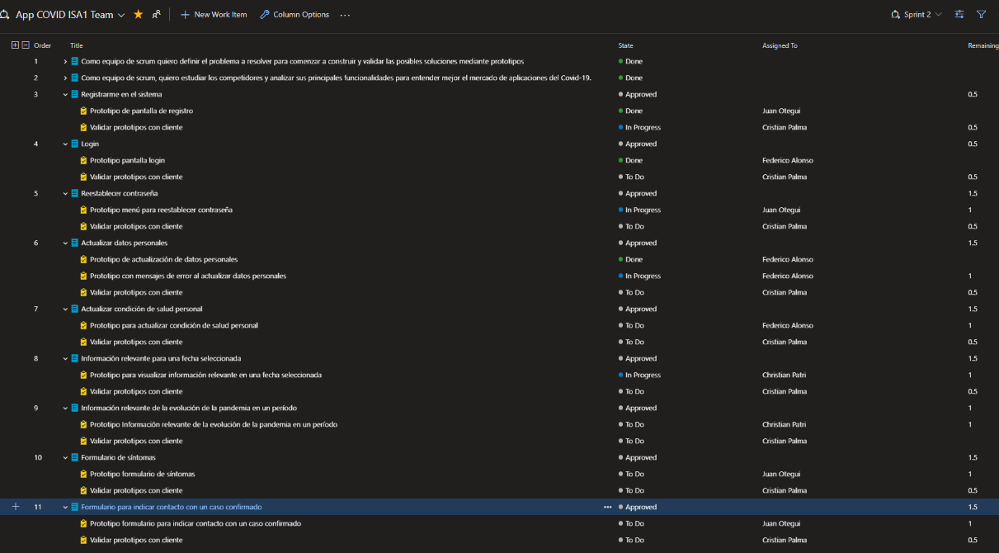
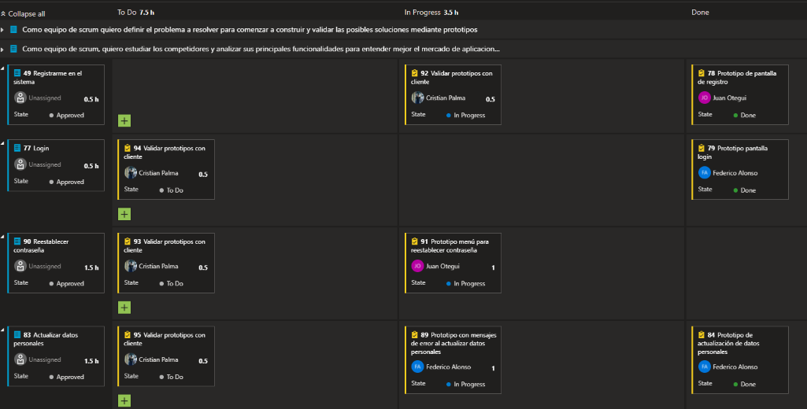
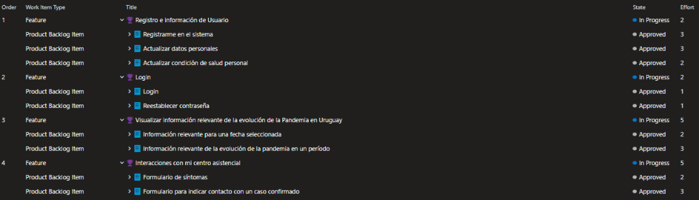

## Planificación del sprint 2 

### Objetivo concreto de la iteración

Los objetivos de esta iteración son:

* Aplicar las sugerencias planteadas #issues por el docente.
* Completar las tareas pendientes del sprint 1
* Completar los prototipos y validarlos del 50% del total de épicas del product backlog.

Las épicas a completar en este sprint son:

* Registro e información de usuario
* Login
* Visualizar información relevante de la evolución de la Pandemia en Uruguay
* Interacciones con mi centro asistencial

### Sprint backlog de la iteración

### Tareas y distribución de esfuerzo de los diferentes integrantes del proyecto

### Estimaciones utilizadas para planificar la iteración

Para planificar la iteración se utilizó la técnica de "Estimación poker", ya sabiendo las historias de usuario que serían parte de este sprint utilizando: https://www.planitpoker.com/

