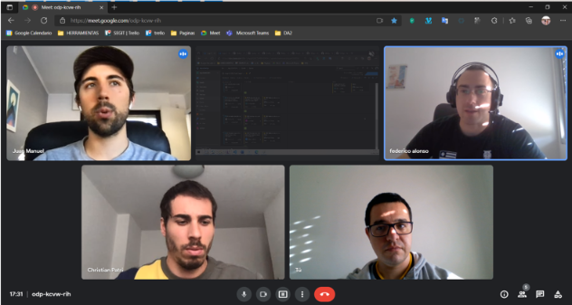
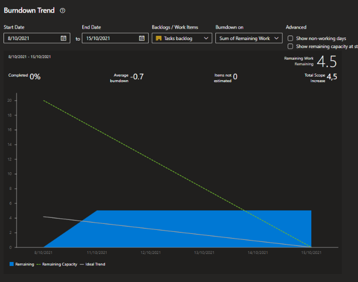

## Minuta de Daily meeting 

#### Fecha : 15-10-2021
#### Integrantes : 

>Cristian Palma - Product Owner\
 Federico Alonso - Desarrollador\
 Christian Patri - Scrum Master\
 Juan Otegui - Desarrollador

 

#### Seguimiento de la iteración

** Nota: La gráfica fue mal tomada ya que el sprint finaliza el 22/10/2021. Ahi se puede observar que el equipo no llegaría a completar las tareas.

#### El Objetivo es responder

* ¿Qué se hizo desde la última daily meeting?

* ¿Qué se va hacer hasta la próxima daily meeting?

* ¿He tenido algun problema o inconveniente?

>Cristian Palma - No\
 Federico Alonso - No\
 Christian Patri - No\
 Juan Otegui - No

#### Comentarios: 

* Se realizará el próximo Daily meeting el 18/10/2021 a las 18:00