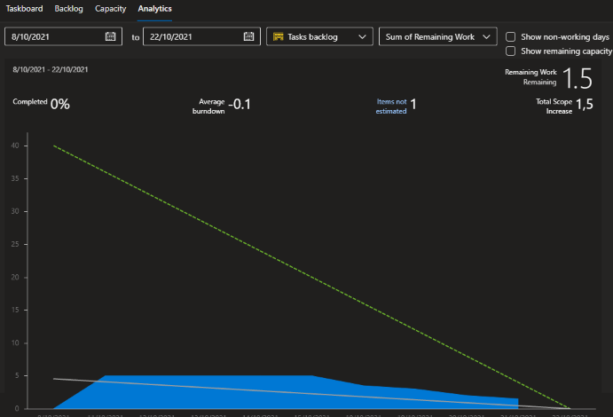

## Minuta de Daily meeting 

#### Fecha : 18-10-2021
#### Integrantes : 

>Cristian Palma - Product Owner\
 Federico Alonso - Desarrollador\
 Christian Patri - Scrum Master\
 Juan Otegui - Desarrollador

#### Seguimiento de la iteración

Como conlusión, podemos notar que se va a completar a tiempo con las tareas planificadas en el sprint 2, pero el equipo tiene capacidad de resolver más tareas que las actualmente asignadas.

Cabe destacar, que las tareas reflejadas en la gráfica corresponden a la prototipación, pero el equipo ha invertido tiempo para estudiar los conceptos que requiere hacer la documentación de este proyecto y estas tareas no estan siendo contabilizadas.

#### El Objetivo es responder

* ¿Qué se hizo desde la última daily meeting?

* ¿Qué se va hacer hasta la próxima daily meeting?

* ¿He tenido algun problema o inconveniente?

>Cristian Palma - No\
 Federico Alonso - No\
 Christian Patri - No\
 Juan Otegui - No

#### Comentarios: 

* Se realizará el próximo Daily meeting el 20/10/2021 a las 18:00
