## Minuta de Spring review 

#### Fecha : 22-10-2021
#### Integrantes : 

>Cristian Palma - Product Owner\
 Federico Alonso - Desarrollador\
 Christian Patri - Scrum Master\
 Juan Otegui - Desarrollador

#### Seguimiento de la iteración

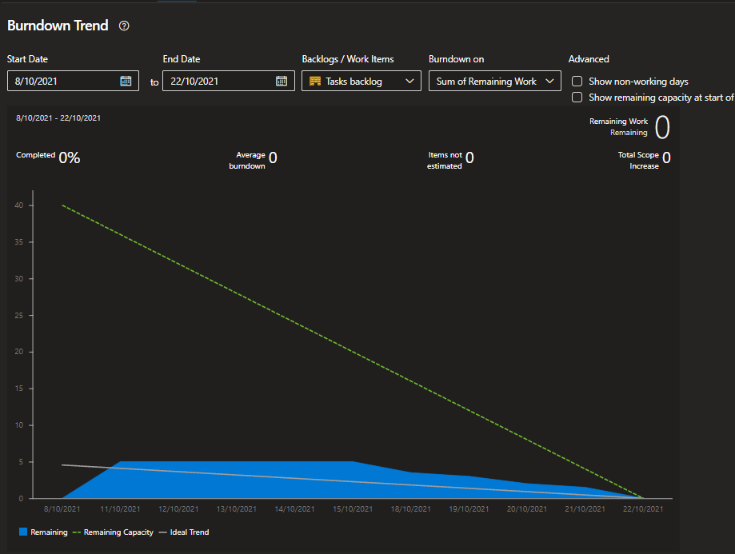

El equipo pudo completar todas las tareas asignadas al presente spring.

#### Presentación de prototipos

##### Pantalla de Registro
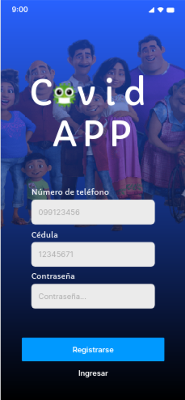

##### Pantalla de Login
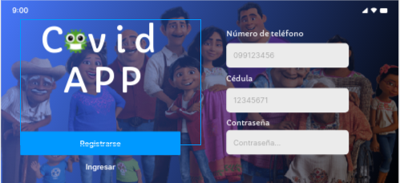

##### Actualización de datos personales
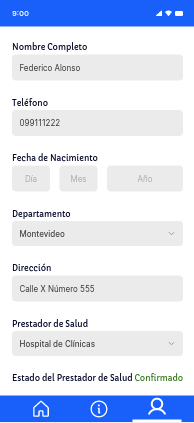
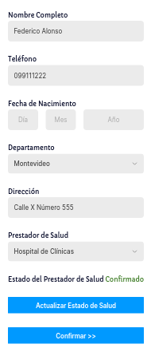

##### Actualizar condición de salud personal
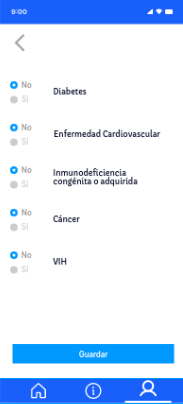

##### Reestablecer contrasña
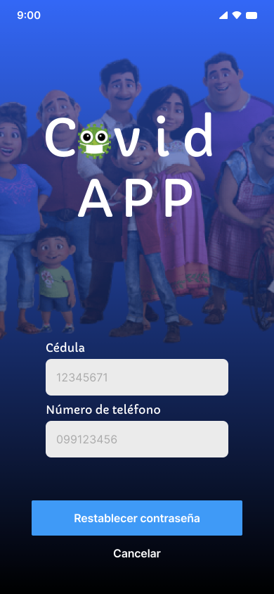

##### Visualizar información relevante en una fecha
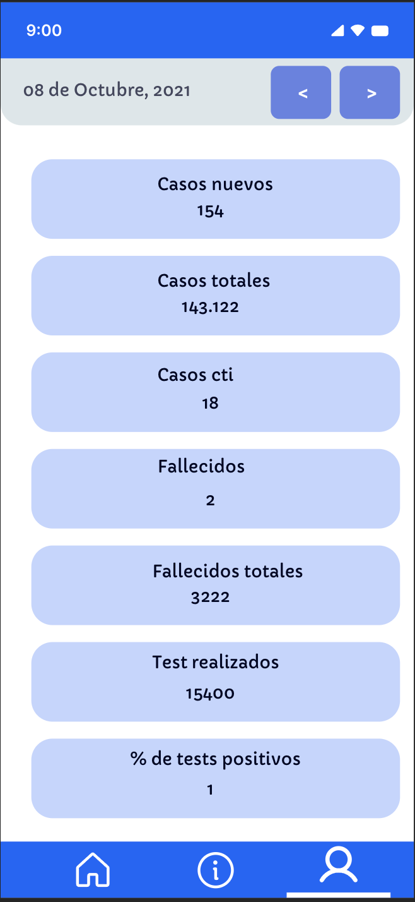

##### Visualizar información relvante en un período
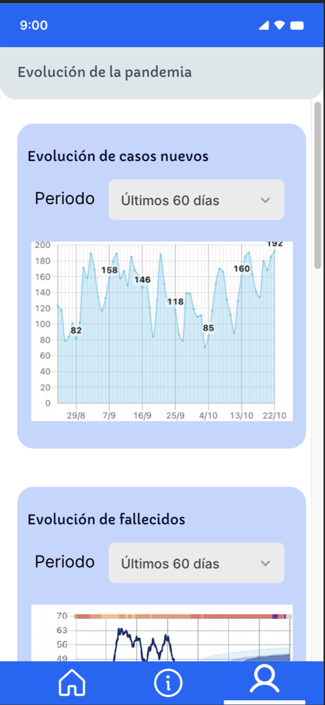
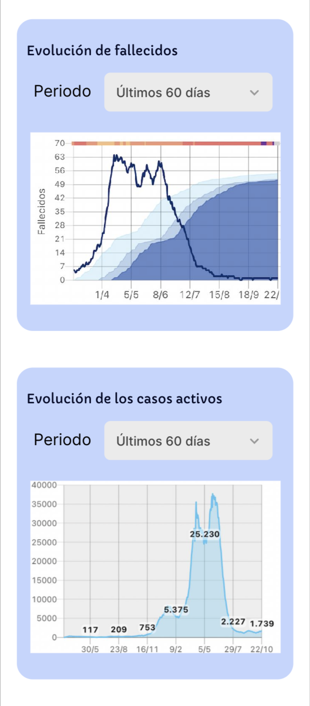
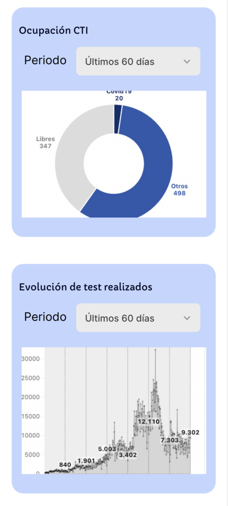

##### Formulario de síntomas
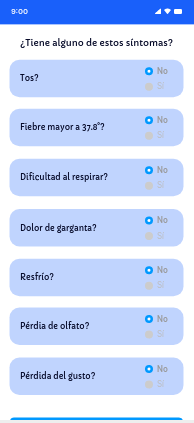

##### Formulario para indicar contacto con un caso confirmado
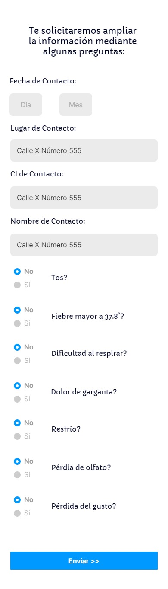

##### Comentarios del cliente: 

Pantalla de login:

* Falta botón a resetear contraseña.

Pantalla informacion por fecha:

* Faltaría un título indicativo a la pantalla. Ademas, la barra del footer no hace referencia al boton de Información.

Pantalla informacion relevante:

* La barra del footer no hace referencia al boton de Información.

Pantalla datos personales:

* Datos personales no informa si guardó los datos.
* Se dificulta visualizar el aceptar para confirmar los cambios, queda debajo del footer.

Pantalla registrar síntomas:

* La pantalla no informa si se envió el cuestionario.

#### Revisión de objetivos del sprint

En el product backlog para el presente sprint se planificó:

1. Aplicar las sugerencias planteadas #issues por el docente.
2. Completar las tareas pendientes del sprint 1
3. Completar los prototipos y validarlos del 50% del total de épicas del product backlog.

Análisis:

1. Se responde a las issues del docente y se utilizan las sugerencias planteadas, se documentan los acuerdos faltantes, se usan herramientas de retrospectivas sugeridas, se re-organiza el documento.
2. Se completa priorizar prototipos principales, se realiza el story map y se arma la estructura general del documento.
3. Se completan los prototipos acordados, tras la validación con el cliente se registran los errores y solicitudes y quedarán pendientes para la siguiente iteración.