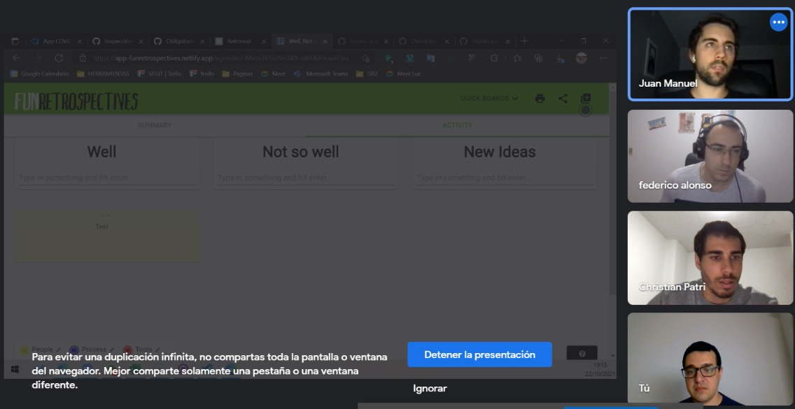
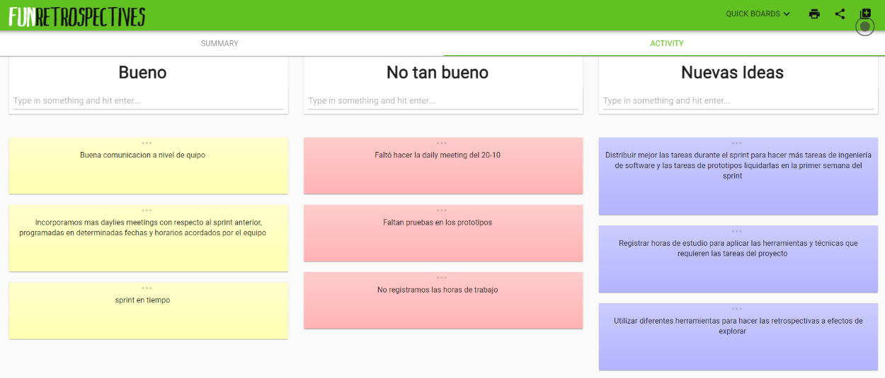

## Minuta de Spring Retrospective 

#### Fecha : 22-10-2021
#### Integrantes : 

>Cristian Palma - Product Owner
 Federico Alonso - Desarrollador
 Christian Patri - Scrum Master
 Juan Otegui - Desarrollador

 

#### Se utiliza nueva herramienta tomando la sugerencia en el #issue 5:
https://github.com/juanmaotegui/ObligatorioISA/issues/5

#### Comentarios: 

* El equipo se compromete a mejorar en aplicar mejor las técnicas de ingeniería de software, ya que en el presente spring se invirtió más tiempo en el desarrollo de los prototipos lo que provocó que haya poca interacción con el cliente.
* Para el siguiente sprint vamos a planificar terminar todos los prototipos en la primer semana para luego tener más tiempo para verificar y validar los mismos.