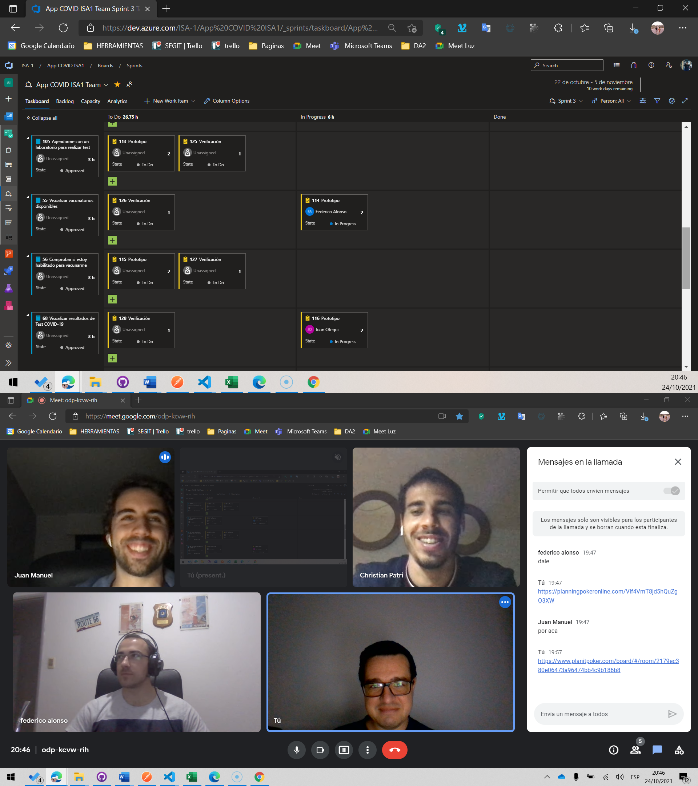
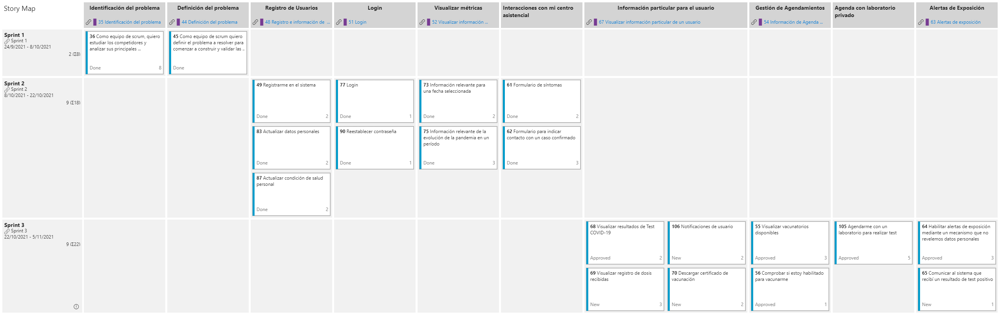
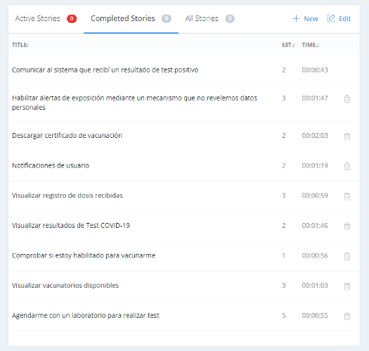
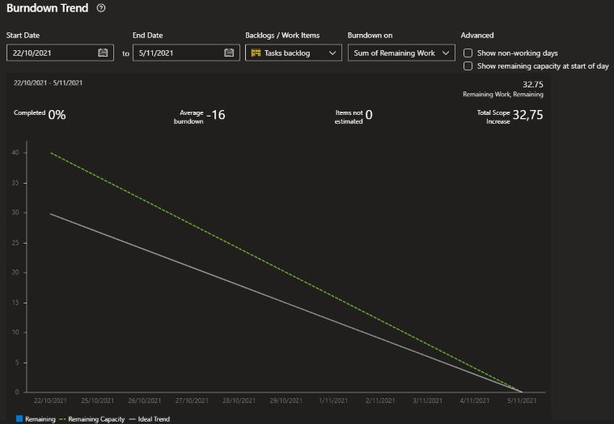

## Minuta del Spring Planning del Sprint 3 

#### Fecha : 24-10-2021
#### Integrantes : 

>Cristian Palma - Product Owner
 Federico Alonso - Desarrollador
 Christian Patri - Scrum Master
 Juan Otegui - Desarrollador

 

### Objetivo de la iteación

Los objetivos de esta iteración son:

* Corregir los bugs de los prototipos realizados en el sprint 2
* Terminar con todos los prototipos del miniproyecto en la primer semana del sprint.
* Validar con usuarios los siguientes prototipos:

    1.  Actualizar condición de salud personal.
    2.  Enviar formulario de cotacto con un caso  positivo a mi centro de salud.
    3.  Agendarme con un laboratorio privado para realizar un test.
    4.  Descargar certificado de vacunación.

Las épicas a completar en este sprint son:

* Gestión de Agenda Test Laboratorio Privado
* Información de Agenda para la vacuna contra COVID-19
* Visualizar información particular de un usuario
* Alertas de exposición

#### Presentación de las historias de usuario y estimación de puntos de historia.

 

#### Story points

Utilizando la herramienta https://www.planitpoker.com/ hicimos la estimación de las historias de usuario del presente sprint:

 

 #### Tareas por historia de usuario

 Para cada historia de usuario se agregó tareas de realizar el prototipo y su correspondiente verificación.

 Además del sprint 2 surgieron Bugs, los cuales también se agregaron al presente sprint con sus respectivas tareas.

 Se estimaron las horas en esta reunión para todas las tareas del sprint, obteniendo la siguiente burndown chart al inicio:

  

  Del mismo podemos concluir que el equipo tiene un margen de tiempo para poder solucionar imprevistos, ya que según el presente gráfico las horas estimadas estan levemente por debajo de la capacidad del equipo.

  #### Asignación de tareas

  El equipo se asignó 1 tarea por miembro a efectos de comenzar con la iteración y ya tener un progreso para el próximo daily meeting que será llevado a cabo el 27-10-2021 a las 18:00.