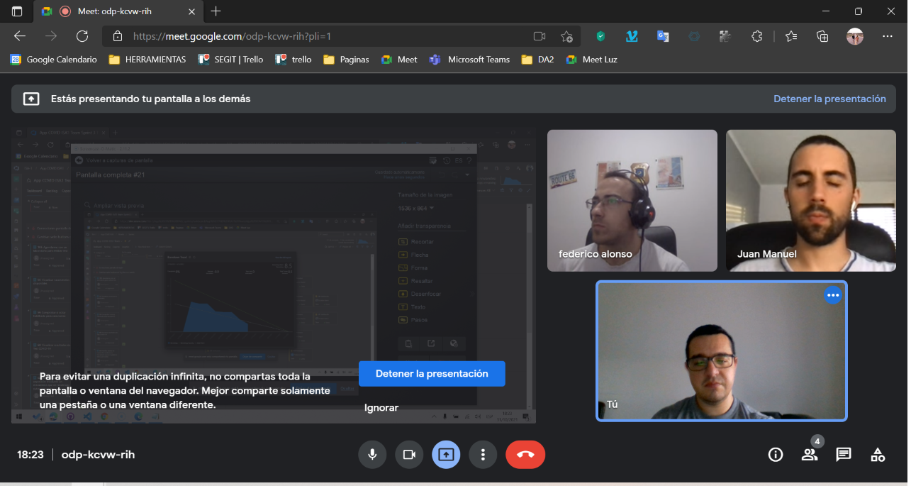
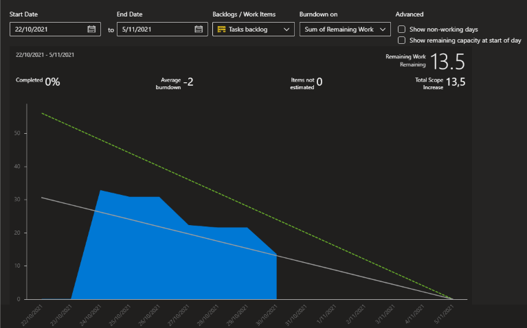

## Minuta de Daily meeting 

#### Fecha : 29-10-2021
#### Integrantes : 

>Cristian Palma - Product Owner
 Federico Alonso - Desarrollador
 Christian Patri - Scrum Master
 Juan Otegui - Desarrollador

 

#### Seguimiento de la iteración

Se observa que el equipo viene cumpliendo correctamente con el seguimiento de la iteración según lo planificado.

#### ¿Qué se hizo desde la última daily meeting?

1- Prototipo agendarme con un laboratorio para realizar test (Federico Alonso)
2- Prototipo comunicar al sistema que recibí un resultado de test positivo (Christian Patri)
3- Prototipo descargar certificado de vacunación (Juan Otegui)
4- Verificación visualizar vacunatorios disponibles (Cristian Palma)

#### ¿Qué se va hacer hasta la próxima daily meeting?

El equipo se compromete a realizar la verificación de todos los prototipos hasta el próximo daily meeting durante el fin de semana, con el objetivo de utilizar la última semana del spring para hacer las 4 validaciones de las funcionalidades relevantes.

#### ¿He tenido algun problema o inconveniente?

>Cristian Palma - No\
 Federico Alonso - No\
 Christian Patri - No\
 Juan Otegui - No

#### Comentarios: 

Próxima Daily meeting : 01-11-2021