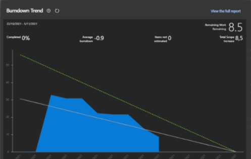

## Minuta de Daily meeting 

#### Fecha : 01-11-2021
#### Integrantes : 

>Cristian Palma - Product Owner
 Federico Alonso - Desarrollador
 Christian Patri - Scrum Master
 Juan Otegui - Desarrollador

#### Seguimiento de la iteración

Se observa que el equipo viene cumpliendo correctamente con el seguimiento de la iteración según lo planificado.

#### ¿Qué se hizo desde la última daily meeting?

El equipo completó la verificación de todos los prototipos excepto los que se detallan a continuación:

* Prototipo 13: Visualizar resultados de Test COVID-19
* Prototipo 15: Ver las notificaciones que llegan al perfil de usuario
* Protoipo 17: Habilitar alertas de exposición. 

#### ¿Qué se va hacer hasta la próxima daily meeting?

Completar la verificación de los siguientes prototipos:

* Prototipo 13: Visualizar resultados de Test COVID-19  --> Federico Alonso
* Prototipo 15: Ver las notificaciones que llegan al perfil de usuario  --> Juan Otegui
* Protoipo 17: Habilitar alertas de exposición. --> Christian Patri
* Grabación del Flujo de iteracción de los protototipos --> Cristian Palma 

#### ¿He tenido algun problema o inconveniente?

>Cristian Palma - No\
 Federico Alonso - No\
 Christian Patri - No\
 Juan Otegui - No

#### Comentarios: 

Próxima Daily meeting : 03-11-2021