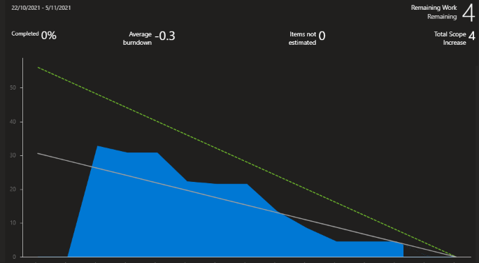

## Minuta de Daily meeting 

#### Fecha : 03-11-2021
#### Integrantes : 

>Cristian Palma - Product Owner
 Federico Alonso - Desarrollador
 Christian Patri - Scrum Master
 Juan Otegui - Desarrollador

#### Seguimiento de la iteración

Se observa que el equipo viene cumpliendo correctamente con el seguimiento de la iteración según lo planificado.
Para los últimos dos días se prevee hacer las 4 validaciones restantes con una duración de 1 hora cada una.

#### ¿Qué se hizo desde la última daily meeting?

Se completó la verificación de los siguientes prototipos:

* Prototipo 13: Visualizar resultados de Test COVID-19  --> Federico Alonso
* Prototipo 15: Ver las notificaciones que llegan al perfil de usuario  --> Juan Otegui
* Protoipo 17: Habilitar alertas de exposición. --> Christian Patri
* Grabación del Flujo de iteracción de los protototipos --> Cristian Palma 

#### ¿Qué se va hacer hasta la próxima daily meeting?

Validar con usuarios los siguientes prototipos:

* 3- Actualizar condicion de salud personal
* 9- Enviar formulario de contacto con un caso positivo a mi centro asistencial
* 10-Agendarme con un laboratorio privado para realizar un test
* 16-Descargar el certificado de vacunación

#### ¿He tenido algun problema o inconveniente?

>Cristian Palma - No\
 Federico Alonso - No\
 Christian Patri - No\
 Juan Otegui - No

#### Comentarios: 

Próxima reunión: 05-11-2021 para el cierre de la iteración.