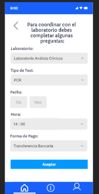
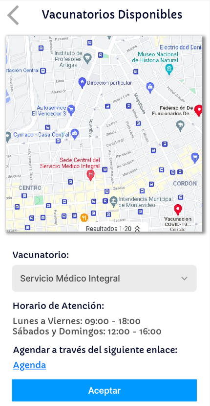
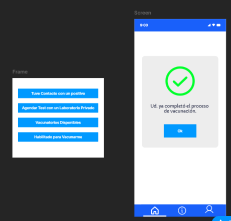
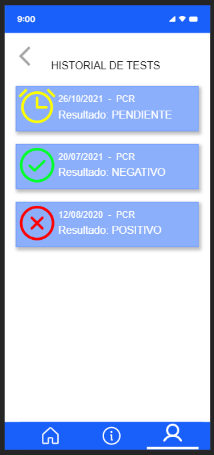
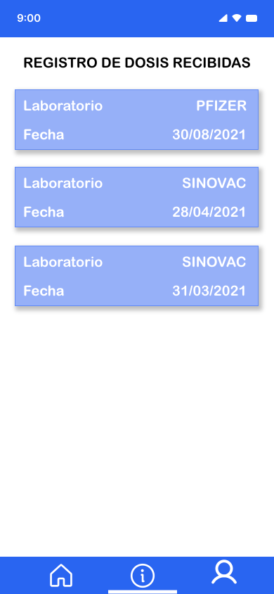
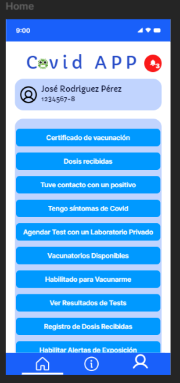
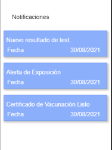
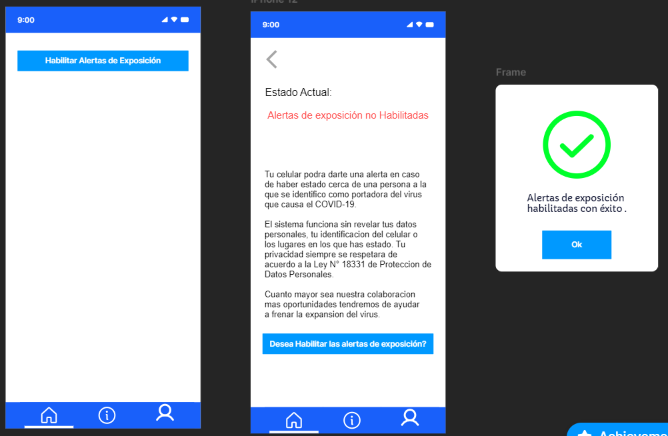

## Minuta de Spring review 

#### Fecha : 05-11-2021
#### Integrantes : 

>Cristian Palma - Product Owner\
 Federico Alonso - Desarrollador\
 Christian Patri - Scrum Master\
 Juan Otegui - Desarrollador

#### Seguimiento de la iteración

El equipo pudo completar todas las tareas asignadas al presente spring. Se observa que el equipo mantuvo una velocidad en el entorno a la esperada.

#### Presentación de prototipos

##### Agendarme con un laboratorio para realizar test

##### Visualizar vacunatorios disponibles

##### Comprobar si esoy habilitado para vacunarme

##### Visualizar resultados de test COVID-19

##### Visualizar registro de mis dosis recibidas

##### Ver notificaciones

##### Descargar certificado de vacunación

##### Habilitar alertas de exposición

##### Comunicar al sistema que recibi un resultado positivo

##### Comentarios del cliente: 

Agendarme con un laboratorio para realizar test:

* Falta indicar precio del test antes de confirmar la operación.

Comunicar al sistema que recibi un resultado positivo:

* Se debe informar al usuario para que está haciendo esta acción. Qué proceso ocurre luego que selecciona confirmar y que ocurre si no informa.

#### Revisión de objetivos del sprint

En el product backlog para el presente sprint se planificó:

1. Se cumplió en corregir los bugs de los prototipos realizados en el sprint 2
2. Se cumplió en terminar con todos los prototipos del miniproyecto en la primer semana del sprint.
3. Se cumplió con validar con con usuarios todos los 4 prototipos más relevantes:

    *  Actualizar condición de salud personal.
    *  Enviar formulario de cotacto con un caso positivo a mi centro de salud.
    *  Agendarme con un laboratorio privado para realizar un test.
    *  Descargar certificado de vacunación.

4. Si bien en este sprint se hizo la verificación de todos los prototipos, no hubo tiempo para tomarlas en cuenta para hacer las correcciones pertinentes.
5. Lo mismo pasó con las validaciones, se hicieron pero no hubo tiempo para hacer las mejoras en los prototipos con el feedback recibido.
6. Concluimos que deberíamos haber tomado menos cantidad de prototipos y sobre ellos hacer las correcciones de la verificación y validación durante la presente iteración, ya que ahora estas correcciones se deberán efectuar en otro sprint.
