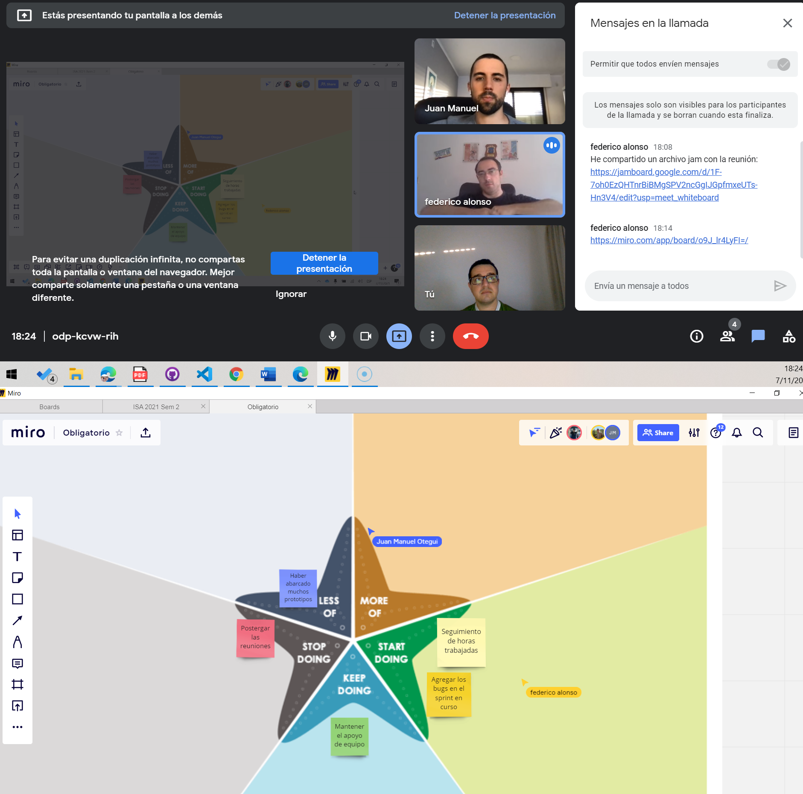
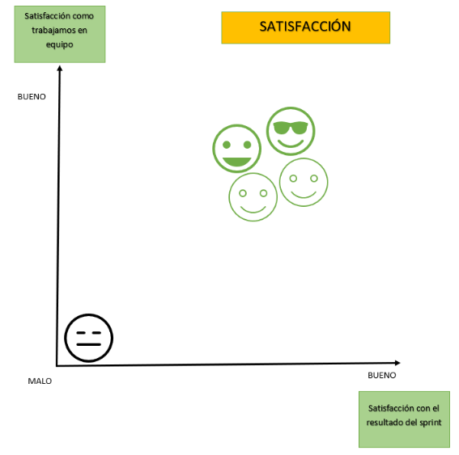
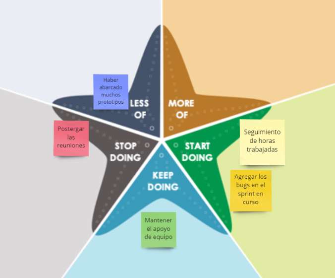

## Minuta de Spring Retrospective 

#### Fecha : 05-11-2021
#### Integrantes : 

>Cristian Palma - Product Owner
 Federico Alonso - Desarrollador
 Christian Patri - Scrum Master
 Juan Otegui - Desarrollador

#### Se utiliza otra herramienta tomando la sugerencia en el #issue 5:
https://github.com/juanmaotegui/ObligatorioISA/issues/5

##### 3 por 1 - Apertura
Chequear satisfacción con los resultados del sprint, coordinación & estado de animo, todo a la vez.

##### Estrella de Mar 

Recolectar que se quiere empezar a hacer, dejar de hacer, mantener, hacer más o hacer menos.

#### Comentarios: 

* Para cubrir los requerimientos solicitados en el miniproyecto se realizaron 18 prototipos, los cuales se hicieron entre el sprint 2 y 3 confeccionando 9 por cada iteración. 
* Esto provocó no contar con tiempo de aplicar las mejoras surgidas en el feedback de la verificación y no poder hacer la validación de todos los prototipos, por eso se tuvo que seleccionar los 4 más relevantes.
* Esto nos dejó un aprendizaje en cuanto a la estimación y como mejorar la planificación de los sprint, teniendo en cuenta las tareas de aplicar las correcciones surgidas durante la verificación y validación.